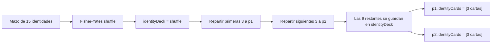
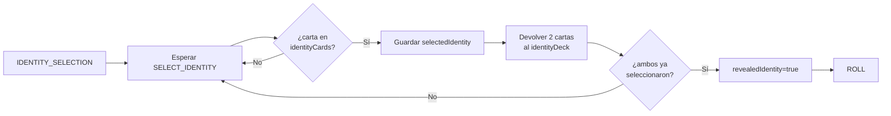

[docs](../../docs.md) > [arquitectura](../docs.md) > [fases](./docs.md) > 01-identidad

[volver](./docs.md) | [next](./02-dados.md)

# Fase: IDENTITY_SELECTION

Subfase de `PREPARATION`. Cada jugador recibe 3 cartas de identidad de un mazo barajado de 15, selecciona 1 y la revela.

## Construcción del mazo

Al iniciar la partida, `createInitialGameState()` construye un mazo de **15 cartas de identidad** (una por cada general del juego) usando `buildIdentityDeck(seed)`:

```
robin_hood_1       → Robin Hood (Arquero)
francotirador_1    → Francotirador del Bosque (Arquero)
dios_trueno_1      → Dios del Trueno (Infantería)
capitan_guardia_1  → Capitán de la Guardia (Infantería)
caballos_guerra_1  → Caballos de Guerra (Caballería)
cazadores_1        → Cazadores (Caballería)
punta_lanza_1      → Punta de Lanza (Lancero)
espartano_1        → Espartano (Lancero)
monje_shaolin_1    → Monje Shaolin (General)
corazon_estratega_1 → Corazón de Estratega (General)
comandante_supremo_1 → Comandante Supremo (General)
inspiracion_real_1 → Inspiración Real (General)
furia_tirano_1     → Furia del Tirano (General)
samurai_1          → Samurái (General)
escudo_comandante_1 → Escudo del Comandante (General)
```

### Barajado y reparto



El mazo `identityDeck` persiste en el estado del juego. Cuando un jugador selecciona su carta, las 2 no elegidas se devuelven al mazo.

## Estado de entrada

```
gamePhase: 'PREPARATION'
preparationPhase: 'IDENTITY_SELECTION'
```

Cada `PlayerResources` tiene:
- `identityCards: [...]` (3 cartas del mazo barajado, distintas para cada jugador)
- `selectedIdentity: undefined`
- `revealedIdentity: undefined`

## Acción aceptada

| Action | Payload | Quién |
|--------|---------|-------|
| `SELECT_IDENTITY` | `{ playerId, cardId }` | Cada jugador |

## Flujo



## Reglas

1. Cada jugador selecciona **una** carta de sus 3 identidades.
2. Al seleccionar, las 2 cartas no elegidas se devuelven al `identityDeck`.
3. La selección es **definitiva** — no se puede cambiar.
4. Cuando **ambos** han seleccionado, las identidades se revelan automáticamente (`revealedIdentity: true`) y se avanza a `ROLL`.
5. Mientras falte un jugador, el estado permanece en `IDENTITY_SELECTION`.
6. Solo importa la `selectedIdentity` — las cartas en `identityCards` se limpian tras la selección.

## Handler

- Reparto inicial: `src/shared/game/init.ts` → `createInitialGameState()`
- Mazo: `src/shared/game/actions/card.ts` → `buildIdentityDeck()`, `shuffleArray()`
- Selección y devolución al mazo: `src/shared/game/phases/identity.ts` → `handleIdentity()`
- Estado: `src/shared/game/state.ts` → `GameState.identityDeck: CardId[]`

## Transición

→ `preparationPhase: 'ROLL'`
