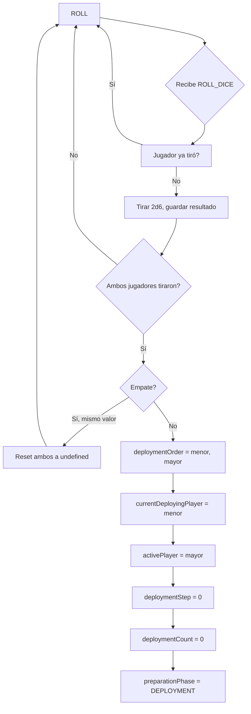

[docs](../../docs.md) > [arquitectura](../docs.md) > [fases](./docs.md) > 02-dados

[volver](./docs.md) | [prev](./01-identidad.md) | [next](./03-despliegue.md)

# Fase: ROLL

Subfase de `PREPARATION`. Determina el orden de despliegue y el primer jugador activo mediante tirada de 2d6.

## Estado de entrada

```
preparationPhase: 'ROLL'
diceRolls: { p1: undefined, p2: undefined }
```

## Acción aceptada

| Action | Payload | Quién |
|--------|---------|-------|
| `ROLL_DICE` | `{ playerId }` | Cada jugador (una vez) |

## Flujo



## Reglas

1. Cada jugador tira **2d6** (rango 2–12).
2. Una tirada por jugador — si intenta repetir, se ignora.
3. **Empate**: ambos resultados se resetean a `undefined` y ambos deben volver a tirar.
4. **Sin empate**:
   - **Puntuación menor** → despliega primero (`currentDeployingPlayer`).
   - **Puntuación mayor** → jugador activo en la partida (`activePlayer`).

## Handler

`src/shared/game/phases/roll.ts` → `handleRoll()`

## RNG

Usa `roll2d6(rngSeed)` de `src/shared/game/utils/rng.ts`, que actualiza la semilla del estado.

## Transición

→ `preparationPhase: 'DEPLOYMENT'`
