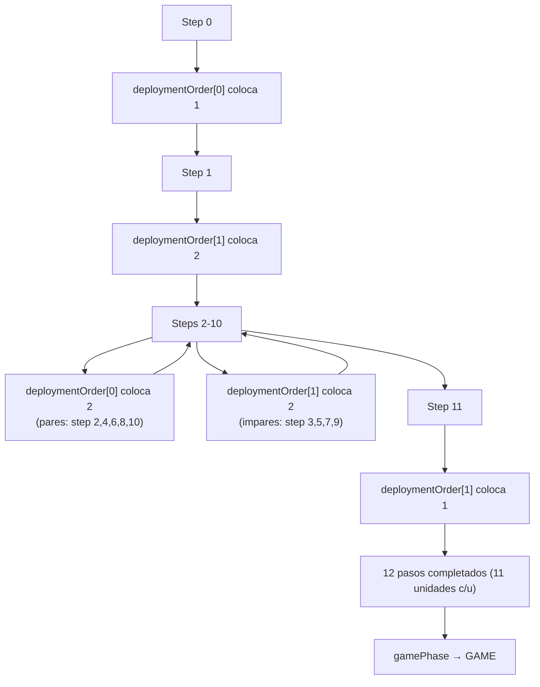
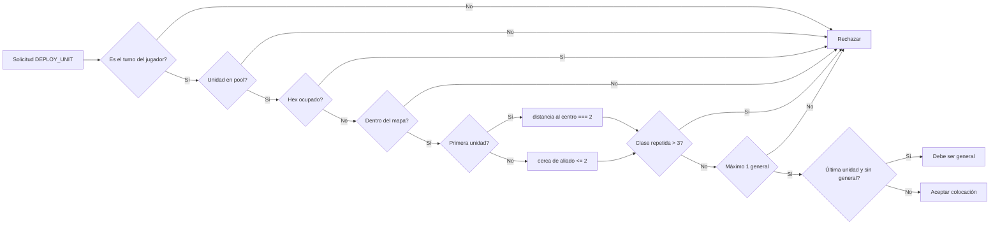
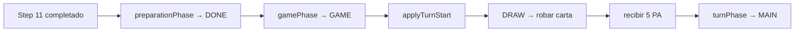

[docs](../../docs.md) > [arquitectura](../docs.md) > [fases](./docs.md) > 03-despliegue

[volver](./docs.md) | [prev](./02-dados.md) | [next](./04-0-flujo-del-juego.md)

# Fase: DEPLOYMENT

Subfase de `PREPARATION`. Los jugadores colocan sus 11 unidades en el tablero alternando turnos según el orden definido en `ROLL`.

## Estado de entrada

```
preparationPhase: 'DEPLOYMENT'
deploymentStep: 0        // 0–11
deploymentCount: 0       // unidades colocadas en el paso actual
deploymentOrder: ['p1', 'p2']  // o al revés, según dados
currentDeployingPlayer: <quien coloca ahora>
```

Cada jugador tiene `unitsToDeploy: [u1..u11]` y `deployedUnits: []`.

## Acción aceptada

| Action | Payload | Quién |
|--------|---------|-------|
| `DEPLOY_UNIT` | `{ playerId, unitId, position, class }` | `currentDeployingPlayer` |

## Patrón de despliegue (1-2-2-2-2-2-2-1)



| Step | Quién coloca | Unidades |
|------|-------------|----------|
| 0 | `deploymentOrder[0]` | 1 |
| 1 | `deploymentOrder[1]` | 2 |
| 2 | `deploymentOrder[0]` | 2 |
| 3 | `deploymentOrder[1]` | 2 |
| 4 | `deploymentOrder[0]` | 2 |
| 5 | `deploymentOrder[1]` | 2 |
| 6 | `deploymentOrder[0]` | 2 |
| 7 | `deploymentOrder[1]` | 2 |
| 8 | `deploymentOrder[0]` | 2 |
| 9 | `deploymentOrder[1]` | 2 |
| 10 | `deploymentOrder[0]` | 2 |
| 11 | `deploymentOrder[1]` | 1 |

**Total por jugador**: 11 unidades (1 general + 10 de otras clases).

## Restricciones de colocación



1. **Primera unidad**: debe estar a distancia **exactamente 2** del centro.
2. **Unidades siguientes**: deben estar a distancia **≤ 2** de una unidad aliada ya colocada.
3. **Clase repetida**: máximo **3** unidades de la misma clase.
4. **General**: máximo **1**. Si es la última unidad del jugador y aún no colocó general, **debe** ser general.
5. **Hex ocupado**: no se puede colocar sobre otra unidad.
6. **Dentro del mapa**: la posición debe estar dentro del mapa (`isWithinBounds`).

## Handler

`src/shared/game/phases/deployment.ts` → `handleDeployment()`

## Creación de unidad

```typescript
const unit = createUnit(action.unitId, action.playerId, action.position, action.class);
```

`createUnit()` en `src/shared/game/units/factory.ts` crea la unidad con:
- Stats base según clase (`src/shared/game/units/stats.ts`)
- `abilities` asignadas desde `CLASS_ABILITIES` (`src/shared/game/data/abilities.ts`)

## Transición

Cuando ambos jugadores han colocado sus 11 unidades (step 11 completado), `preparationPhase` pasa a `DONE`. Se inicia el primer turno del `activePlayer` (el ganador del ROLL, `deploymentOrder[1]`) con la misma secuencia que cualquier otro turno: `DRAW` → robar 1 carta → recibir 5 PA → `MAIN`.



El jugador empieza con 1 carta en mano y 5 PA, listo para jugar en `MAIN`.
