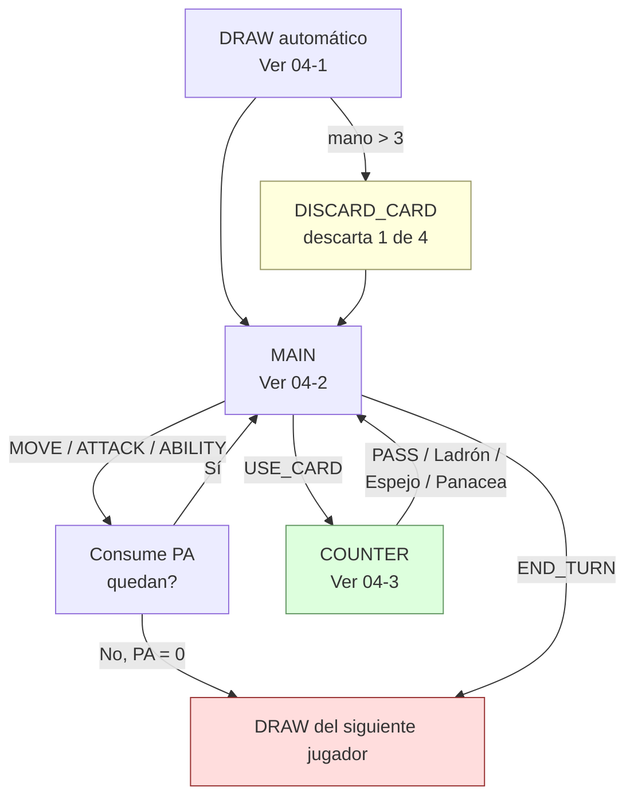

[docs](../../docs.md) > [arquitectura](../docs.md) > [fases](./docs.md) > 04-0-flujo-del-juego

[volver](./docs.md) | [prev](./03-despliegue.md) | [next](./04-1-draw.md)

# Fase: GAME — Flujo general

Una vez finalizado el despliegue, `gamePhase` pasa a `'GAME'`. El juego transcurre en turnos alternos. Cada turno comienza con `DRAW` (automático) y continúa en `MAIN`, donde el jugador tiene control total para intercalar acciones y cartas libremente mientras tenga recursos. Si juega una carta BUFF/DEBUFF, se desvía brevemente a `COUNTER` para que el rival responda, y vuelve a `MAIN`.

| Subfase | Acceso | Documento |
|---------|--------|-----------|
| `DRAW` | Automática al iniciar turno | [`04-1-draw.md`](04-1-draw.md) |
| `MAIN` | Tras DRAW | [`04-2-main.md`](04-2-main.md) |
| `COUNTER` | Al jugar BUFF/DEBUFF | [`04-3-counter.md`](04-3-counter.md) |

## Archivos relacionados

- Inicio de turno: `src/shared/game/phases/turn.ts` → `applyTurnStart()`
- Fin de turno: `src/shared/game/phases/turn.ts` → `handleEndTurn()`
- Enrutamiento general: `src/shared/game/reducer.ts` → `applyAction()`
