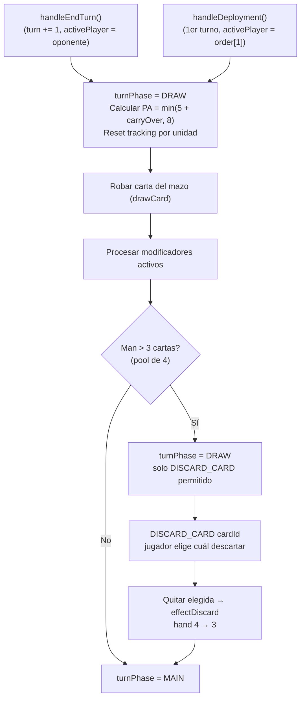

[docs](../../docs.md) > [arquitectura](../docs.md) > [fases](./docs.md) > 04-1-draw

[volver](./docs.md) | [prev](./04-0-flujo-del-juego.md) | [next](./04-2-main.md)

# Subfase: DRAW

Subfase automática al iniciar el turno de un jugador. Se ejecuta desde `applyTurnStart()` en `src/shared/game/phases/turn.ts`.

## Flujo



## Cálculo de PA

```
PA base = 5
carryOver del turno anterior = floor(PA_restante / 2)
PA total = min(5 + carryOver, 8)
```

## Reset de tracking por unidad

Al inicio del turno, cada unidad del jugador activo resetea:

```typescript
timesDamagedThisTurn: 0
attackedThisTurn: false
usedCarga: false
usedCabalgar: false
usedVentajaAlcance: false
usedDobleAtaque: false
usedFuegoCobertura: false
usedAvance: false
hasCargaBonus: false
didMovePreviousTurn: false  // solo si estaba definido
```

## Límite de mano (hand size)

El jugador tiene un máximo de **3 cartas** en mano. Si al robar (`drawCard`) la mano ya tiene 3 cartas, la carta robada **entra igual** formando un pool de 4. El jugador debe elegir qué carta descartar mediante `DISCARD_CARD { playerId, cardId }`:

- Se descarta la carta elegida a `effectDiscard` (puede ser cualquiera de las 4: una existente o la recién robada).
- La mano vuelve a 3 cartas y `turnPhase` avanza a `MAIN`.
- Mientras la mano tenga más de 3 cartas, solo `DISCARD_CARD` está permitido (el resto de acciones son rechazadas en el reducer).

## Handler

`src/shared/game/phases/turn.ts` → `applyTurnStart()`
