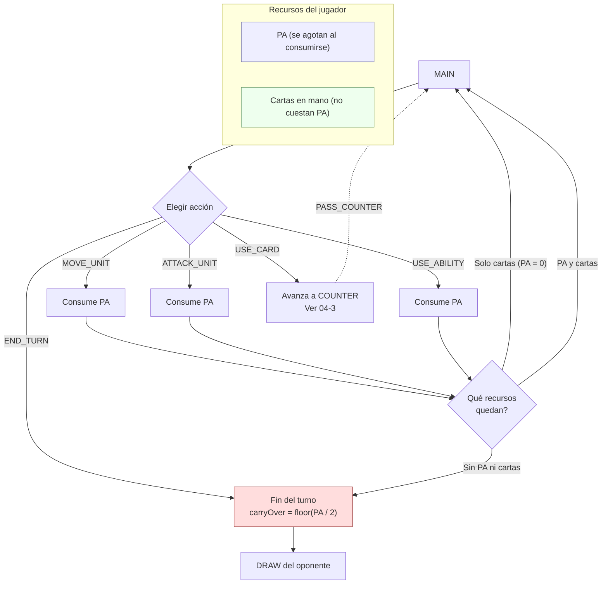

[docs](../../docs.md) > [arquitectura](../docs.md) > [fases](./docs.md) > 04-2-main

[volver](./docs.md) | [prev](./04-1-draw.md) | [next](./04-3-counter.md)

# Subfase: MAIN

Primera subfase activa del turno, tras completar `DRAW`. El jugador activo puede ejecutar acciones que consumen PA o jugar cartas.

## Acciones disponibles

| Acción | Consume PA | Efecto |
|--------|-----------|--------|
| `MOVE_UNIT` | Según coste de movimiento | Mueve una unidad a un hex adyacente |
| `ATTACK_UNIT` | 1 PA (o coste modificado) | Ataca a una unidad enemiga |
| `USE_ABILITY` | Según habilidad | Activa una habilidad especial de la unidad |
| `USE_CARD` | 0 | Juega una carta BUFF/DEBUFF → desencadena `COUNTER` |
| `END_TURN` | — | Termina el turno, pasa al oponente |

## Bucle de acciones

El jugador no sigue una secuencia fija. En todo momento puede elegir libremente entre las acciones disponibles mientras tenga recursos (PA o cartas). Cada acción se resuelve y el jugador vuelve al mismo estado de elección.

- `USE_CARD` no consume PA pero desencadena `COUNTER`; al resolverse el contrajuego, se vuelve a `MAIN` con los mismos recursos.
- `END_TURN` está siempre disponible, incluso con PA o cartas restantes. `carryOver = floor(PA_restantes / 2)`.

## Handlers

- Movimiento: `src/shared/game/actions/move.ts` → `handleMove()`
- Ataque: `src/shared/game/actions/attack.ts` → `handleAttack()`
- Habilidad: `src/shared/game/actions/ability.ts` → `handleAbility()`
- Carta: `src/shared/game/actions/card.ts` → `handleCard()`
- Fin de turno: `src/shared/game/phases/turn.ts` → `handleEndTurn()`
