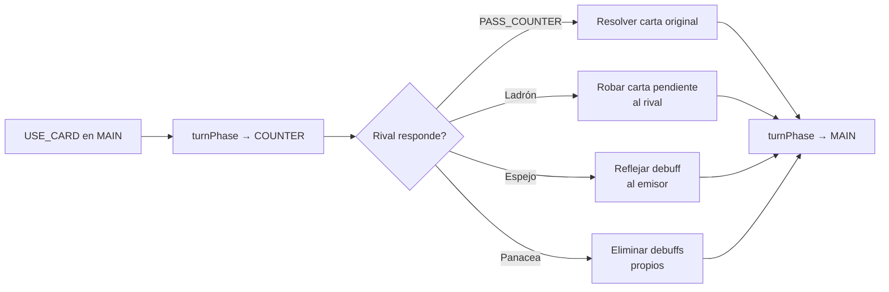

[docs](../../docs.md) > [arquitectura](../docs.md) > [fases](./docs.md) > 04-3-counter

[volver](./docs.md) | [prev](./04-2-main.md) | [next](./05-movimiento.md)

# Subfase: COUNTER

Subfase opcional que se activa cuando un jugador juega una carta BUFF/DEBUFF desde `MAIN`. El rival tiene oportunidad de responder.

## Flujo

## Acciones disponibles

| Acción | Quién | Válida contra | Efecto |
|--------|-------|---------------|--------|
| `PASS_COUNTER` | El rival (`playerId !== activePlayer`) | BUFF o DEBUFF | La carta pendiente se resuelve, vuelve a MAIN |
| `USE_CARD` (Ladrón) | El rival | BUFF o DEBUFF | Roba la carta pendiente para usarla en su turno |
| `USE_CARD` (Espejo) | El rival | Solo DEBUFF | Refleja un debuff al emisor original |
| `USE_CARD` (Panacea) | El rival | Solo DEBUFF | Elimina todos los debuffs propios |

## Transición

Una vez resuelto el COUNTER (pase o contrajuego), `turnPhase` vuelve a `MAIN` con el mismo jugador activo.

## Handlers

- `src/shared/game/actions/card.ts` → `handleCard()` (para Ladrón, Espejo, Panacea)
- `src/shared/game/actions/card.ts` → `handlePassCounter()` (para pasar)
