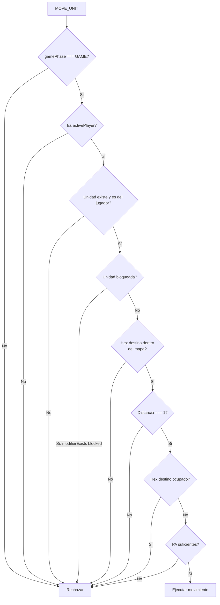
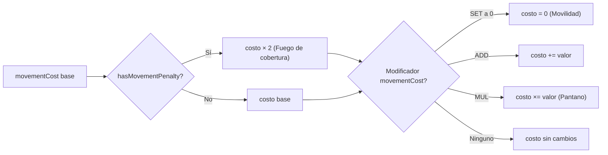
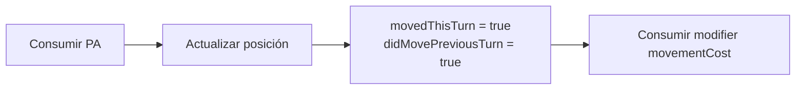
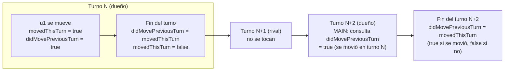

[docs](../../docs.md) > [arquitectura](../docs.md) > [fases](./docs.md) > 05-movimiento

[volver](./docs.md) | [prev](./04-3-counter.md) | [next](./06-combate.md)

# Acción: MOVE_UNIT

Disponible en subfase `MAIN`.

## Especificación

| Campo | Valor |
|-------|-------|
| Action type | `MOVE_UNIT` |
| Payload | `{ playerId, unitId, to: HexCoord }` |
| Costo base | `movementCost` de la unidad |
| Distancia máxima | 1 hex por acción |

## Flujo de validación

## Cálculo del costo

## Ejecución

## Ciclo de flags de movimiento

| Flag | Se activa en | Se resetea en | Propósito |
|------|-------------|---------------|-----------|
| `movedThisTurn` | Movimiento (`move.ts`) | `applyTurnStart` (`turn.ts`) | Tracking intra-turno |
| `didMovePreviousTurn` | Movimiento (`move.ts`) + `handleEndTurn` (`turn.ts`) | `handleEndTurn` (`turn.ts`) | Consulta en MAIN + combate del rival |

`didMovePreviousTurn` persiste durante el turno del rival (donde se usa en combate) y durante el MAIN del dueño (donde el jugador puede consultarlo).

## Modificadores relevantes

| Modificador | Origen | Efecto |
|-------------|--------|--------|
| `movementCost SET 0` | Carta Movilidad | Primer movimiento cuesta 0 PA |
| `movementCost MUL 2` | Carta Pantano | Primer movimiento cuesta el doble |
| `blocked` | Carta Confusión | Unidad no puede moverse ni atacar |
| `hasMovementPenalty` | Habilidad Fuego de cobertura | Coste ×2 |

## Handler

`src/shared/game/actions/move.ts` → `handleMove()`
