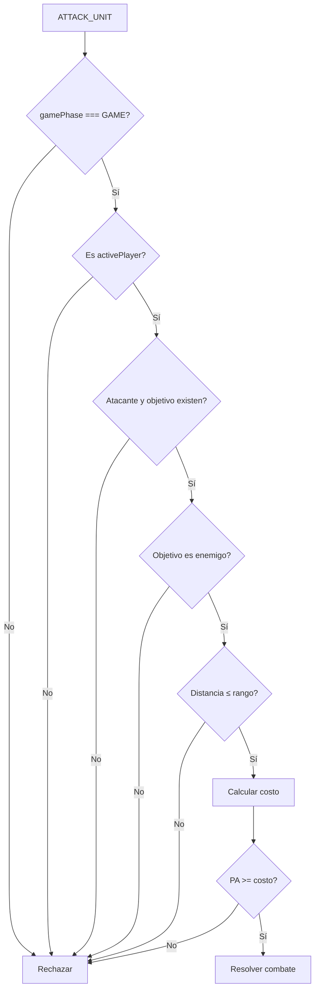
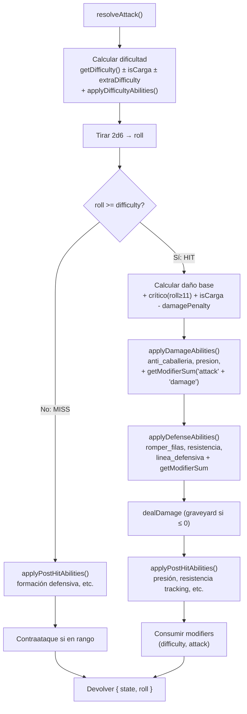
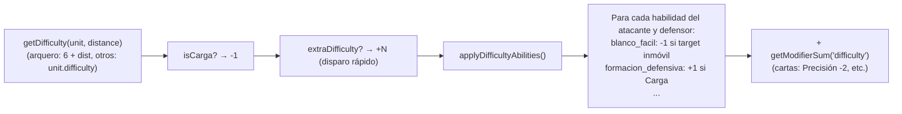
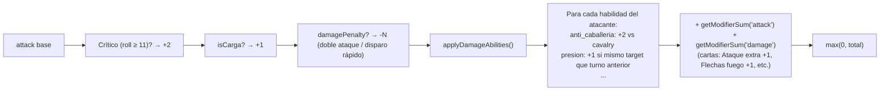
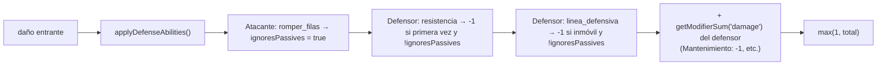
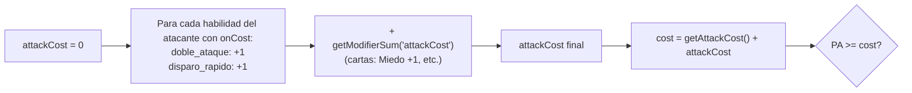

[docs](../../docs.md) > [arquitectura](../docs.md) > [fases](./docs.md) > 06-combate

[volver](./docs.md) | [prev](./05-movimiento.md) | [next](./07-cartas.md)

# Acción: ATTACK_UNIT + Resolución de combate

Disponible en subfase `MAIN`.

## Especificación

| Campo | Valor |
|-------|-------|
| Action type | `ATTACK_UNIT` |
| Payload | `{ playerId, unitId, targetId }` |
| Costo | `getAttackCost()` (=1) + `applyCostAbilities()` (suma modificadores por habilidad: `doble_ataque: +1` + `getModifierSum(attackCost)` de cartas: Miedo +1). Se calcula en `handleAttack()` vía `applyCostAbilities()` directamente. |
| Rango | `unit.range` |

## Flujo de validación



## Resolución de ataque (resolver.ts)



## Cálculo de dificultad

La dificultad se calcula al inicio de `resolveAttack()` (antes del roll) y se modifica recorriendo las habilidades registradas en `ability-effects.ts`:



### Factores que modifican dificultad

| Factor | Origen | Efecto |
|--------|--------|--------|
| `blanco_facil` | Hook `onDifficulty` en `ABILITY_EFFECTS` | -1 |
| Carga | `isCarga` seteado por `handleCarga` (ability.ts:137) | -1 |
| Disparo rápido | `extraDifficulty: 1` seteado por `handleDisparoRapido` (ability.ts:63) | +1 |
| `formacion_defensiva` | Hook `onDifficulty` en `ABILITY_EFFECTS` | +1 |

## Cálculo de daño

El daño se calcula solo en la rama HIT de `resolveAttack()`: se parte de `unit.attack`, se aplica crítico, `isCarga`, `damagePenalty`, y luego se recorren las habilidades del atacante y los modificadores activos vía `applyDamageAbilities()`:



### Factores que modifican daño de ataque

| Factor | Origen | Efecto |
|--------|--------|--------|
| Crítico | `roll ≥ 11` | +2 |
| Carga | `isCarga: true` seteado por `handleCarga` (ability.ts:137) | +1 |
| `anti_caballeria` | Hook `onDamage` en `ABILITY_EFFECTS` | +2 |
| `presion` | Hook `onDamage` en `ABILITY_EFFECTS` | +1 |
| Doble ataque / Disparo rápido | `damagePenalty: 1` seteado por los handlers en ability.ts | -1 |

## Pasivas de defensa

Se aplican en `applyDefenseAbilities()` recorriendo habilidades del atacante y defensor:



### Habilidades de defensa

| Habilidad | Dueño | Condición | Efecto |
|-----------|-------|-----------|--------|
| `romper_filas` | Atacante | — | Ignora Resistencia y Línea defensiva |
| `resistencia` | Defensor | Primera vez que recibe daño este turno | -1 daño |
| `linea_defensiva` | Defensor | `didMovePreviousTurn === false` (no se movió) | -1 daño |

## Contraataque

Ocurre cuando el ataque **falla** y el **defensor está en rango** del atacante.

```
daño de contraataque = 2 (fijo)
```

`src/shared/game/combat/counter.ts` → `canCounterattack()` y `getCounterDamage()`

## Efectos post-daño (applyPostHitAbilities)

Se recorren las habilidades de atacante y defensor tras cada ataque (acierto o fallo):

| Habilidad | Dueño | Condición | Efecto |
|-----------|-------|-----------|--------|
| `formacion_defensiva` | Defensor | Ataque con Carga y falla | Atacante recibe 1 de daño |
| `presion` | Atacante | Acierta | `lastTargetId = target.id` |
| `resistencia` / `linea_defensiva` | Defensor | Acierta | `timesDamagedThisTurn += 1` |

## Cálculo de costo

El costo de `ATTACK_UNIT` se calcula **antes de gastar PA** en `handleAttack()` llamando a `applyCostAbilities()` directamente:

```
cost = getAttackCost() + applyCostAbilities(state, unit, target, distancia).attackCost
```

`applyCostAbilities()` solo se ejecuta para acciones `ATTACK_UNIT` (vía `handleAttack`). Las **USE_ABILITY** activas (`doble_ataque`, `disparo_rapido`, etc.) tienen su propio costo fijo hardcodeado en `ability.ts` y **no pasan por `applyCostAbilities`**.

`applyCostAbilities()` inicializa `attackCost = 0` y añade:

1. Hook `onCost` de cada habilidad pasiva del atacante registrada en `ABILITY_EFFECTS`
2. `+ getModifierSum('attackCost')` (cartas: Miedo +1, etc.)

> **Nota:** `doble_ataque` y `disparo_rapido` tienen hook `onCost` que suma +1 al costo del ataque básico `ATTACK_UNIT`. Su versión `USE_ABILITY` cuesta 1 PA fijo (ver `08-habilidades.md`).



### Hooks `onCost` registrados

| Habilidad | Aplica a | Efecto |
|-----------|----------|--------|
| `doble_ataque` | `ATTACK_UNIT` de unidades con esta habilidad | +1 `attackCost` |
| `disparo_rapido` | `ATTACK_UNIT` de unidades con esta habilidad | +1 `attackCost` |

El costo del `USE_ABILITY` correspondiente está definido en `data/abilities.ts` y se cobra en los handlers de `ability.ts`.

## Consumo de modificadores

Tras cada ataque exitoso se consumen en `resolver.ts` y `attack.ts`:

```
consumeModifier(state, atacante, 'difficulty', 1)
consumeModifier(state, atacante, 'attack', 1)
consumeModifier(state, atacante, 'attackCost', 1)  // en handleAttack (attack.ts)
```

## Sistema de efectos data-driven

Las habilidades no están hardcodeadas en el flujo de combate. En su lugar, se registran como handlers en `ability-effects.ts` que modifican un acumulador `CombatResult`:

```typescript
type CombatResult = {
    difficulty: number;   // modificador acumulado
    damage: number;       // modificador acumulado
    attackCost: number;   // modificador acumulado
    ignoresPassives: boolean;  // true si romper_filas está activo
};
```

Cada habilidad puede implementar uno o más hooks:

| Hook | Cuándo se llama | Modifica |
|------|----------------|----------|
| `onCost` | Al calcular costo | `result.attackCost` |
| `onDifficulty` | Al calcular dificultad | `result.difficulty` |
| `onDamage` | Al calcular daño de ataque | `result.damage` |
| `onDefense` | Al aplicar defensas | `result.damage`, `result.ignoresPassives` |
| `onPostHit` | Tras cada ataque (hit o miss) | Estado del juego (estado) |

Para añadir una nueva habilidad de combate, solo hay que registrar su handler en `ABILITY_EFFECTS` sin tocar el flujo de resolución.

## Handlers

- Validación: `src/shared/game/actions/attack.ts` → `handleAttack()`
- Resolución: `src/shared/game/combat/resolver.ts` → `resolveAttack()`
- Efectos de habilidades: `src/shared/game/combat/ability-effects.ts` → `ABILITY_EFFECTS`
