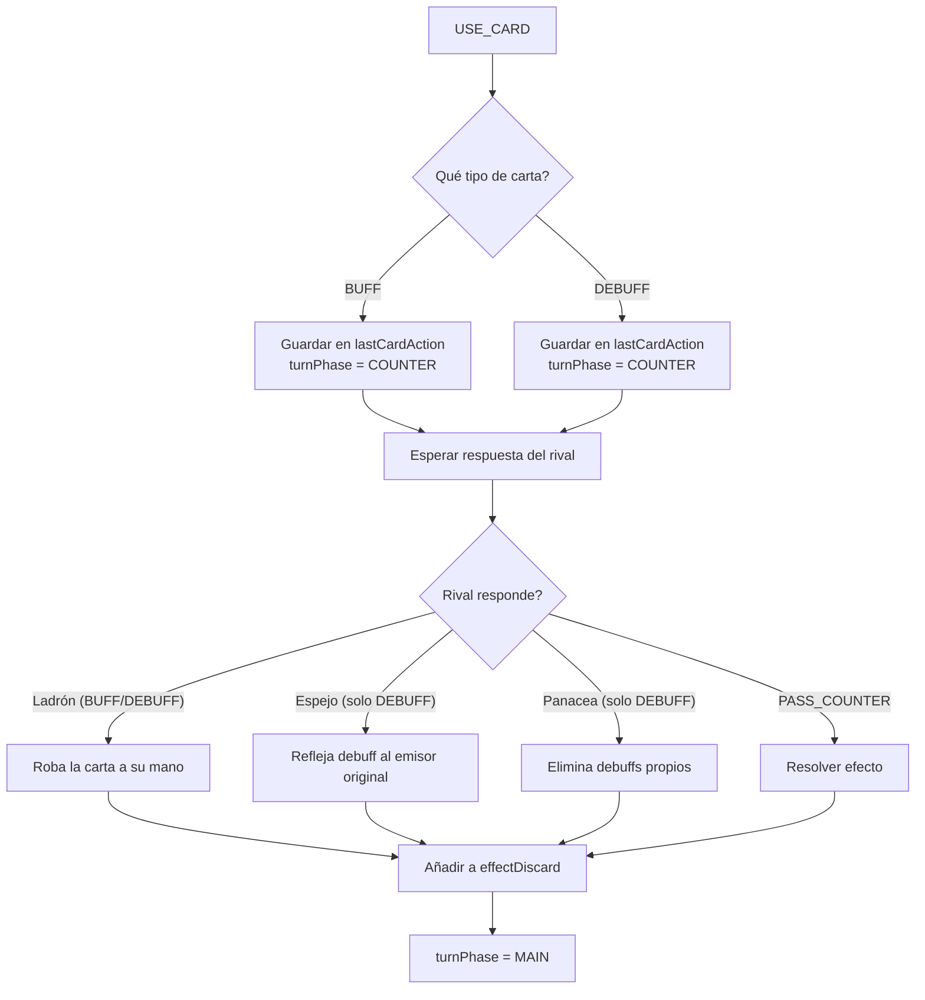

[docs](../../docs.md) > [arquitectura](../docs.md) > [fases](./docs.md) > 07-cartas

[volver](./docs.md) | [prev](./06-combate.md) | [next](./08-habilidades.md)

# Sistema de cartas de efecto + Fase COUNTER

## Mazo de efecto

Consta de **52 cartas** (13 tipos × 4 copias). Se barajan al inicio con `buildEffectDeck(seed)` usando Fisher-Yates.

### Tipos de carta

| Tipo | Comportamiento | Ejemplos |
|------|---------------|----------|
| `BUFF` | Beneficio para el jugador activo | Movilidad, Ataque extra, Precisión, Flechas de fuego, Inspiración de tropa |
| `DEBUFF` | Perjuicio para el oponente | Bajar moral, Pantano, Mantenimiento, Confusión, Miedo |
| `COUNTER` | Respuesta inmediata | Panacea, Ladrón, Espejo |

## Mano y robo

```
drawCard(state, playerId):
  1. Tomar primera carta del mazo (effectDeck[0])
  2. Añadir a cardsInHand
  3. Si mano > 3, queda en pool de 4; el jugador debe ejecutar DISCARD_CARD
     (vía handleDiscard) para elegir qué carta descartar
```

### Descarte manual (DISCARD_CARD)

Cuando la mano excede 3 tras robar, la fase pasa a `DRAW` y solo se acepta `DISCARD_CARD`.
El jugador elige qué carta descartar; al hacerlo la carta va a `effectDiscard` y la fase pasa a `MAIN`.

```typescript
handleDiscard:
    if (turnPhase !== 'DRAW') return state;
    if (player.cardsInHand <= 3) return state;
    // Remover carta elegida, si mano ≤ 3 → MAIN
```

## Flujo de USE_CARD



## Resolución de cartas BUFF/DEBUFF

Cada carta, al resolverse tras `PASS_COUNTER`, crea uno o más `ModifierInstance`:

| Carta | Modificador(es) |
|-------|-----------------|
| Movilidad | `movementCost SET 0` — 1 turno, 1 uso |
| Ataque extra | `attack ADD +1` + `difficulty ADD +2` — 1 uso |
| Precisión | `difficulty ADD -2` — 1 uso |
| Flechas de fuego | `damage ADD +1` (próximo ataque) + `passiveDamage ADD +1` al objetivo × 2 turnos del jugador — total +3 de daño extra |
| Inspiración de tropa | `ap ADD +1` al jugador — 1 turno |
| Bajar moral | `ap ADD -1` al oponente — 1 turno |
| Pantano | `movementCost MUL 2` al oponente — 1 turno, 1 uso |
| Mantenimiento | `damage ADD -1` al oponente — 1 turno, 1 uso |
| Confusión | `blocked SET 1` — 1 turno |
| Miedo | `attackCost ADD +1` al oponente — 1 turno, 1 uso |

## Cartas COUNTER

### Panacea (solo vs DEBUFF)
Elimina todos los modificadores activos que afectan al jugador. Solo válida cuando la carta pendiente es un **DEBUFF**.
En el código, el campo se llama `sourcePlayerId` pero realmente almacena el `targetPlayerId` (a quién se aplica el modificador).
`removePlayerDebuffs(p)` filtra `m.sourcePlayerId !== p`, lo que conserva los modificadores que **no** afectan a `p`, eliminando los que sí lo afectan.

### Ladrón (vs BUFF o DEBUFF)
Requiere `lastCardAction` pendiente del rival. La carta pendiente se añade a la mano del que juega Ladrón; la carta original se descarta sin efecto. Válida contra **BUFF** y **DEBUFF**.

### Espejo (solo vs DEBUFF)
Requiere `lastCardAction` pendiente del rival. Vuelve a aplicar `applyCardEffect` con la carta pendiente pero apuntando al emisor original. Solo válida cuando la carta pendiente es un **DEBUFF**.

## Fase COUNTER

- Entra automáticamente cuando el jugador activo juega una carta BUFF o DEBUFF.
- Solo el rival (no activo) puede responder. El jugador activo **no** puede hacer `PASS_COUNTER` ni jugar cartas COUNTER durante esta fase.
- Las cartas COUNTER válidas dependen del tipo de carta pendiente:
  - **BUFF pendiente**: el rival solo puede jugar **Ladrón** (roba la carta). Espejo y Panacea **no** son válidos.
  - **DEBUFF pendiente**: el rival puede jugar **Ladrón** (roba la carta), **Espejo** (refleja el debuff al emisor) o **Panacea** (elimina sus propios debuffs).
- Si el rival no responde (`PASS_COUNTER`), la carta pendiente se resuelve normalmente.
- Si el rival juega una carta COUNTER, se resuelve inmediatamente y la fase termina (vuelve a `MAIN`).

```typescript
handlePassCounter:
    if (action.playerId === state.activePlayer) return state;
    // Resuelve la carta pendiente
    return { ...resolvePending(state, []), turnPhase: 'MAIN' };
```

## Handler

- Lógica de cartas: `src/shared/game/actions/card.ts` → `handleCard()`, `handlePassCounter()`, `drawCard()`, `applyCardEffect()`
- Mazo: `buildEffectDeck()`, `shuffleArray()`
