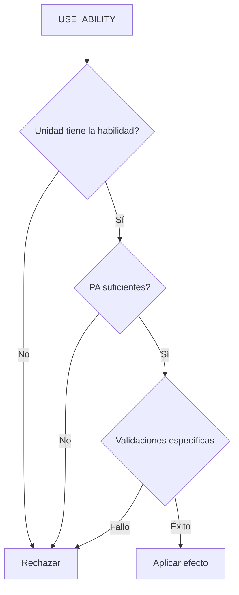

[docs](../../docs.md) > [arquitectura](../docs.md) > [fases](./docs.md) > 08-habilidades

[volver](./docs.md) | [prev](./07-cartas.md) | [next](./09-modificadores.md)

# Habilidades (USE_ABILITY)

Disponible en subfase `MAIN`.

## Arquitectura

Las habilidades se definen como datos y se asignan a clases, no a unidades individuales:

```
ABILITIES: Record<abilityId, { id, name, type, cost, description }>
CLASS_ABILITIES: Record<UnitClass, abilityId[]>
```

Cada unidad tiene un array `abilities: string[]` que se copia de `CLASS_ABILITIES[class]` al crearse con `createUnit()`.

## Tipos de habilidad

### Pasivas (8) — se resuelven automáticamente en combate

No requieren acción del jugador. Se activan durante `resolveAttack()` en `resolver.ts`.

| Habilidad | Clase | Cuándo | Efecto |
|-----------|-------|--------|--------|
| `blanco_facil` | Arquero | Al calcular dificultad | -1 dificultad si el objetivo no se movió el turno anterior |
| `romper_filas` | Caballería | Al aplicar defensas | Ignora Resistencia y Línea defensiva del defensor |
| `anti_caballeria` | Lancero | Al calcular daño | +2 daño contra caballería |
| `formacion_defensiva` | Lancero | Dificultad + Post-daño | +1 dificultad si ataque con Carga; si Carga falla, atacante recibe 1 de daño |
| `resistencia` | Infantería | Al recibir daño | -1 daño la primera vez que recibe daño en el turno |
| `linea_defensiva` | Infantería | Al recibir daño | -1 daño si no se movió el turno anterior (no acumula con Resistencia) |
| `presion` | Infantería | Al calcular daño | +1 daño si ataca al mismo objetivo que el turno anterior |

### Activas (8) — se disparan con USE_ABILITY



| Habilidad | Clase | Costo PA | Requisitos | Efecto |
|-----------|-------|----------|------------|--------|
| `disparo_rapido` | Arquero | 1 | Distancia ≤ 2, 1 vez/turno | Ataque adicional con +1 dificultad |
| `fuego_cobertura` | Arquero | 2 | Dentro de rango, 1 vez/turno | Acierto: target gana `hasMovementPenalty` |
| `cabalgar` | Caballería | 1 | Distancia = 2 en línea recta, 1 vez/turno | Mover 2 hexes |
| `carga` | Caballería | 1 | Requiere Cabalgar previo, objetivo adyacente | Ataque con -1 dificultad y +1 daño |
| `doble_ataque` | Caballería/Lancero | 1 | Mismo objetivo que ataque anterior, no usado con Ventaja alcance | Segundo ataque con -1 daño |
| `ventaja_alcance` | Lancero | 1 | No haber atacado ni usado Doble ataque este turno | Ataque con rango +1 |
| `avance` | Infantería | 1 | Dentro de rango, 1 vez/turno | Si mata, ocupa posición del enemigo |
| `accion_evasiva` | Arquero | 1 | — | Sin implementar (stub) |

## Restricciones por flag

Las habilidades activas usan flags booleanos en `Unit` para evitar re-uso en el mismo turno:

```
usedCabalgar, usedCarga, usedDobleAtaque, usedDisparoRapido, usedVentajaAlcance
usedFuegoCobertura, usedAvance, attackedThisTurn
```

Estos flags se resetean a `false` al inicio del turno del jugador en `resetUnitTracking()`.

## Exclusión mutua

- `ventaja_alcance` y `doble_ataque` no pueden usarse en el mismo turno
- `attackedThisTurn` NO bloquea `disparo_rapido` ni `doble_ataque` (son ataques extra)
- `charge` requiere `usedCabalgar === true`

## Handler

`src/shared/game/actions/ability.ts` → `handleAbility()` con dispatch interno:
- `handleDisparoRapido()`
- `handleFuegoCobertura()`
- `handleCabalgar()`
- `handleCarga()`
- `handleDobleAtaque()`
- `handleVentajaAlcance()`
- `handleAvance()`

Datos de habilidades: `src/shared/game/data/abilities.ts`
