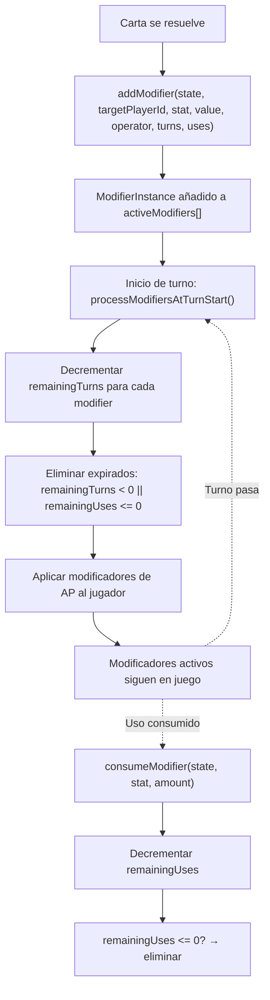
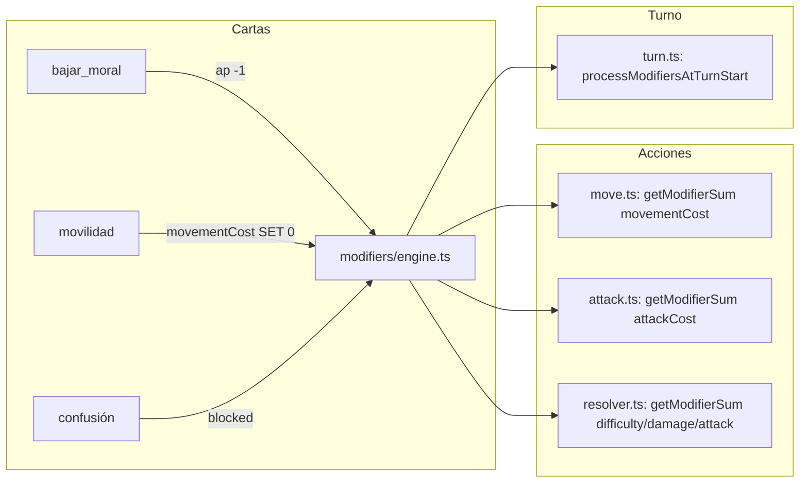

[docs](../../docs.md) > [arquitectura](../docs.md) > [fases](./docs.md) > 09-modificadores

[volver](./docs.md) | [prev](./08-habilidades.md) | [next](./10-fin-del-juego.md)

# Sistema de Modificadores (ModifierInstance)

Los modificadores representan efectos **entre turnos** creados por cartas. Reemplazan flags ad-hoc por una estructura de datos uniforme.

## Estructura

```typescript
type ModifierInstance = {
    id: string;
    sourcePlayerId: string;    // a quién afecta
    stat: string;              // qué estadística modifica
    value: number;
    operator: 'ADD' | 'MUL' | 'SET';
    remainingTurns: number;    // 0 = no expira por turnos
    remainingUses?: number;    // undefined = sin límite
};
```

## Operadores

| Operador | Comportamiento | Ejemplo |
|----------|---------------|---------|
| `ADD` | Se suma al valor base | `damage +1` |
| `MUL` | Multiplica el valor base | `movementCost × 2` |
| `SET` | Reemplaza el valor base | `movementCost = 0` |

## Estadísticas modificables

| Stat | Afecta a | Creado por |
|------|----------|------------|
| `movementCost` | Coste de movimiento | Movilidad (SET 0), Pantano (MUL 2) |
| `attack` | Daño base de ataque | Ataque extra (+1) |
| `difficulty` | Dificultad de ataque | Precisión (-2), Ataque extra (+2) |
| `damage` | Daño final infligido/recibido | Flechas de fuego (+1 atacante), Mantenimiento (-1 defensor) |
| `ap` | Puntos de acción al iniciar turno | Bajar moral (-1) |
| `attackCost` | Coste PA de ataque | Miedo (+1) |
| `blocked` | Unidad no puede moverse/atacar | Confusión |
| `passiveDamage` | Daño automático al iniciar turno (por unidad) | Flechas de fuego (+1 × 2 turnos al objetivo) |
| `dotOnHit` | Marcador: aplica DoT al golpear | Flechas de fuego |

## Ciclo de vida



## Consumo de modificadores

Los modificadores con `remainingUses` se consumen al usar la estadística:

| Modificador | Cuándo se consume |
|-------------|-------------------|
| `movementCost` | Al realizar un movimiento (`handleMove`) |
| `difficulty` | Al realizar un ataque exitoso (`resolveAttack`) |
| `attack` | Al realizar un ataque exitoso (`resolveAttack`) |
| `attackCost` | Al realizar un ataque (`handleAttack`) |

Los modificadores **sin** `remainingUses` (ej: `damage`, `ap`) duran el número de turnos especificado y se eliminan en `processModifiersAtTurnStart`.

## Funciones del engine

| Función | Propósito |
|---------|-----------|
| `addModifier(state, targetPlayerId, targetUnitId, stat, value, operator, turns, uses?)` | Crear y añadir un modifier |
| `getModifierSum(state, targetPlayerId, targetUnitId, stat)` | Suma de valores activos (según operador) |
| `consumeModifier(state, targetPlayerId, stat, amount=1)` | Gastar un uso, eliminar si llega a 0 |
| `modifierExists(state, stat)` | Verificar si hay algún modifier activo con ese stat |
| `removePlayerDebuffs(state, playerId)` | Elimina los modifiers que **afectan** al jugador (sourcePlayerId = playerId). Usado por Panacea. |
| `processModifiersAtTurnStart(state, playerId)` | Decrementar turnos, limpiar expirados, aplicar AP |

## Integración en el sistema



## Handler

`src/shared/game/modifiers/engine.ts` — implementación completa
`src/shared/game/modifiers/types.ts` — definición de tipos
