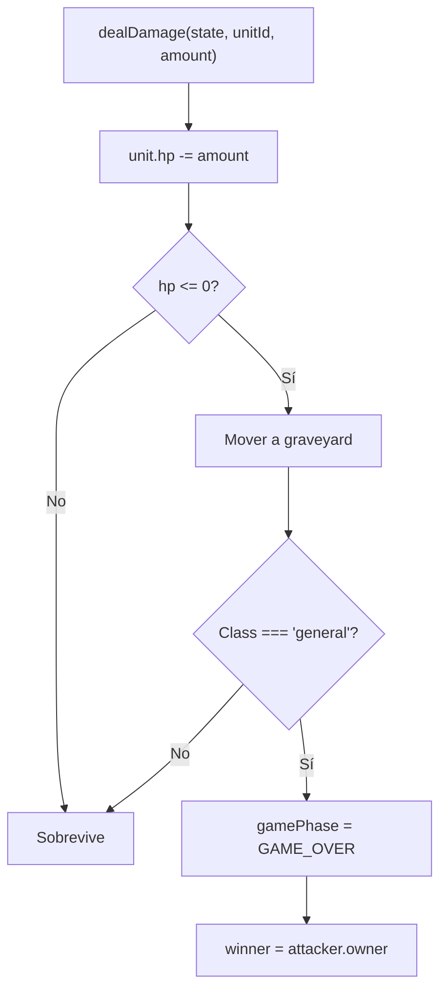
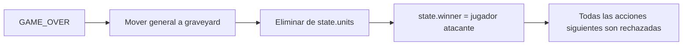

[docs](../../docs.md) > [arquitectura](../docs.md) > [fases](./docs.md) > 10-fin-del-juego

[volver](./docs.md) | [prev](./09-modificadores.md) | [next](./simulacion.md)

# Fase: GAME_OVER

Fase terminal. El juego termina cuando un **general** muere.

## Estado de entrada

Cualquier estado `gamePhase === 'GAME'`

## Disparador

La única forma de alcanzar `GAME_OVER` es mediante `killUnit()` (en `src/shared/game/utils/index.ts`), que se llama desde `dealDamage()` cuando una unidad llega a `hp <= 0`.



## Comportamiento



## Acciones bloqueadas

```typescript
applyAction(state, action):
    if (state.gamePhase === 'GAME_OVER') return state;  // ← todo se rechaza
```

Cualquier acción enviada con `gamePhase === 'GAME_OVER'` devuelve el estado sin mutar.

## Estado final

```typescript
{
    gamePhase: 'GAME_OVER',
    winner: 'p1' | 'p2',
    // El resto del estado se conserva (tablero congelado)
}
```

## Handler

La lógica de game over está integrada en:
- `src/shared/game/utils/index.ts` → `dealDamage()`, `killUnit()`
- `src/shared/game/reducer.ts` → guarda en `applyAction()`
- `src/shared/game/combat/resolver.ts` → llama a `dealDamage()` durante la resolución de ataque
