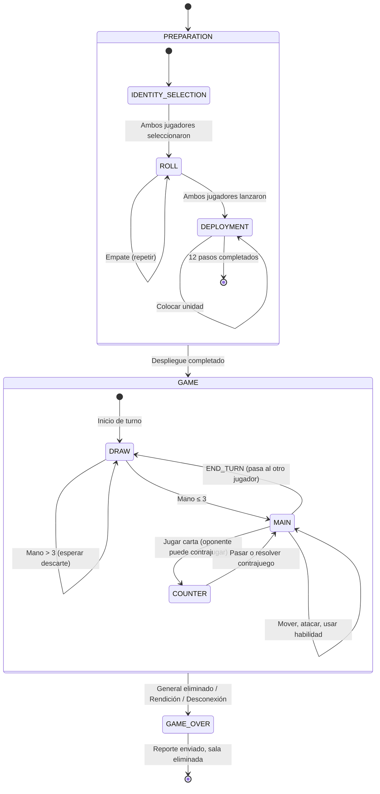
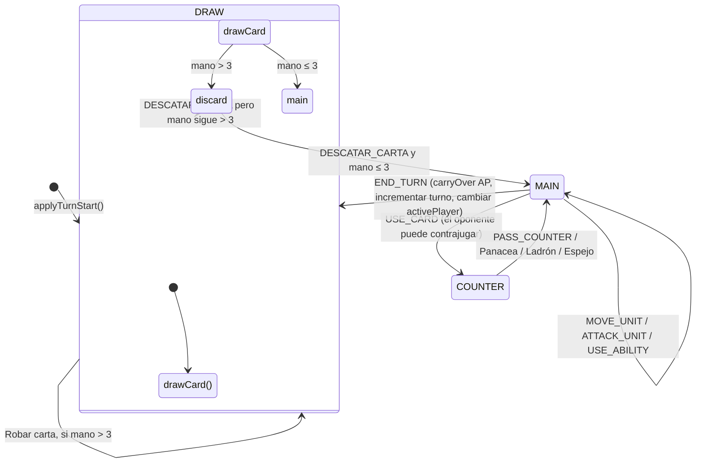
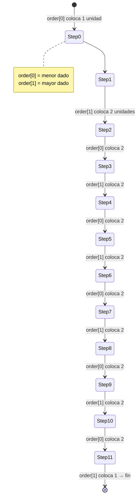
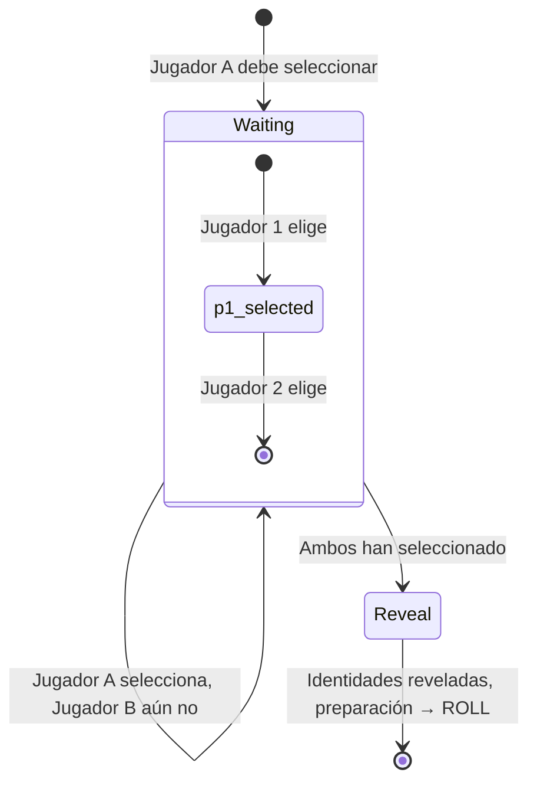
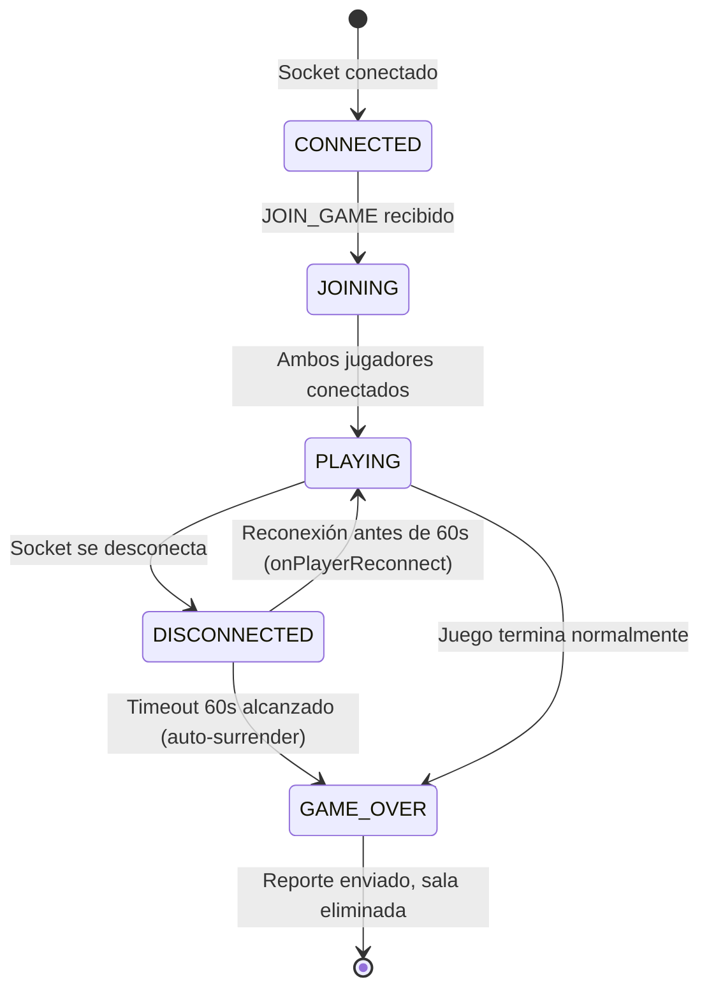

[docs](../docs.md) > [arquitectura](./index.md) > servidor

# 10. Máquinas de estado

## 10.1 Máquina de estados principal: GamePhase

El juego tiene 3 fases principales con transiciones deterministas.



### Transiciones

| Desde | Hasta | Condición | Handler |
|-------|-------|-----------|---------|
| `IDENTITY_SELECTION` | `ROLL` | Ambos `selectedIdentity` definidos | `handleIdentity` |
| `ROLL` | `ROLL` | Empate (`p1Roll === p2Roll`) | `handleRoll` |
| `ROLL` | `DEPLOYMENT` | Ambos dados lanzados | `handleRoll` |
| `DEPLOYMENT` | `DEPLOYMENT` | Unidades restantes en el paso | `handleDeployment` |
| `DEPLOYMENT` | `GAME` | `deploymentStep >= 12` | `handleDeployment` → `applyTurnStart` |
| `GAME` | `GAME_OVER` | General muerto / SURRENDER / disconnect timeout | `checkGeneralKilled` / `applyAction` / `onPlayerDisconnect` |

## 10.2 Máquina de estados: Turno



### Transiciones de turno

| Desde | Hasta | Acción | Handler |
|-------|-------|--------|---------|
| `DRAW` | `DRAW` | `DISCARD_CARD` y mano aún > 3 | `handleDiscard` |
| `DRAW` | `MAIN` | `DISCARD_CARD` y mano ≤ 3 | `handleDiscard` |
| `MAIN` | `MAIN` | `MOVE_UNIT`, `ATTACK_UNIT`, `USE_ABILITY` | handlers respectivos |
| `MAIN` | `COUNTER` | `USE_CARD` (entra en fase de contrajuego) | `handleCard` |
| `MAIN` | `DRAW` | `END_TURN` (cambia `activePlayer`, incrementa `turn`) | `handleEndTurn` → `applyTurnStart` |
| `COUNTER` | `MAIN` | `PASS_COUNTER` (resolver carta) | `handlePassCounter` |

## 10.3 Máquina de estados: Despliegue



### Reglas de validación por step

| Regla | Aplica a |
|-------|----------|
| Primera unidad debe estar a distancia 2 del centro | Step 0 del jugador |
| Unidades siguientes deben estar cerca (≤2) de un aliado | Steps ≥ 1 |
| Máximo 3 unidades por clase | Todos los steps |
| Exactamente 1 general por jugador | Obligatorio |
| Si no hay general desplegado, step 10 debe ser general | Step 10 |

## 10.4 Máquina de estados: Identidad



## 10.5 Máquina de estados: Juego de cartas (COUNTER)

```mermaid
stateDiagram-v2
    [*] --> CARD_PLAYED: Jugador activo juega USE_CARD
    
    CARD_PLAYED --> CARD_PLAYED: Oponente juega contra carta
    
    state CARD_PLAYED {
        [*] --> esperando_respuesta
        
        esperando_respuesta --> panacea: Contrarrestar debuff
        esperando_respuesta --> ladron: Robar carta
        esperando_respuesta --> espejo: Reflejar debuff
        esperando_respuesta --> pass: Pasar contrajuego
    end
    
    panacea --> [*]: Carta resuelta sin debuff
    ladron --> [*]: Carta robada, efecto anulado
    espejo --> [*]: Debuff reflejado al emisor
    pass --> [*]: Carta original resuelta

    note right of CARD_PLAYED
        Solo cartas DEBUFF entran en COUNTER.
        Cartas BUFF se resuelven inmediatamente.
    end note
```

## 10.6 Máquina de estados: Conexión


