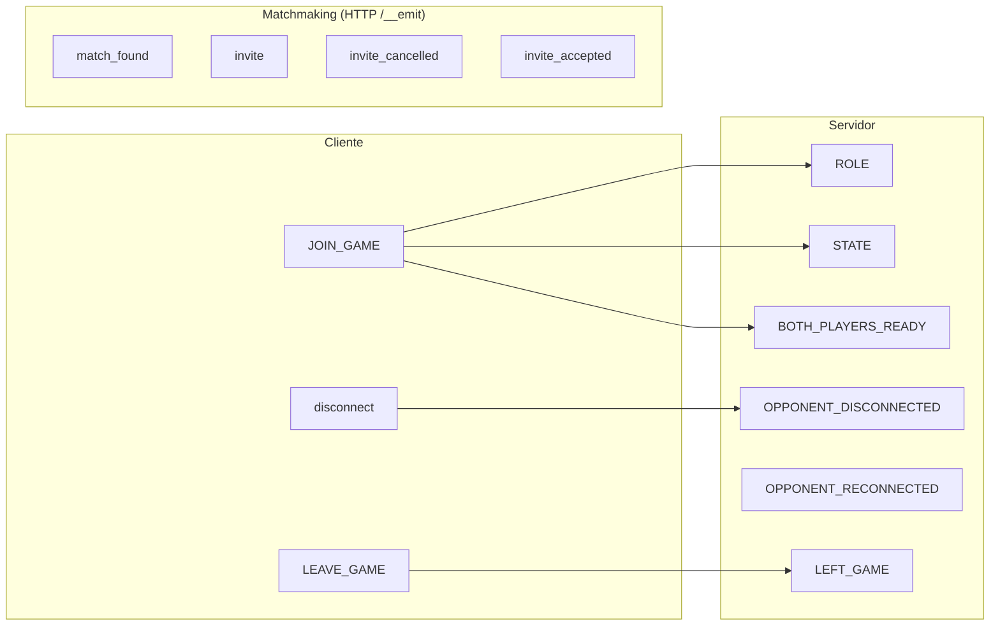
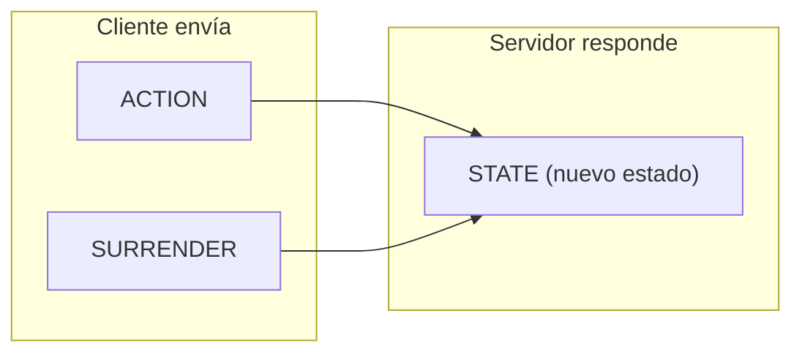

[docs](../docs.md) > [arquitectura](./index.md) > servidor

# 11. Sistema de eventos

## Eventos Socket.IO

### Eventos entrantes (cliente → servidor)

| Evento | Dirección | Propósito | Handler |
|--------|-----------|-----------|---------|
| `JOIN_GAME` | Cliente → Servidor | Unirse a una sala de partida | `index.ts:108` |
| `ACTION` | Cliente → Servidor | Enviar una acción de juego | `index.ts:174` |
| `SURRENDER` | Cliente → Servidor | Rendirse | `index.ts:184` |
| `LEAVE_GAME` | Cliente → Servidor | Abandonar la sala | `index.ts:191` |
| `disconnect` | Cliente → Servidor | Desconexión (automático) | `index.ts:201` |

### Eventos salientes (servidor → cliente)

| Evento | Dirección | Propósito | Destinatario |
|--------|-----------|-----------|-------------|
| `ROLE` | Servidor → Cliente | Asignar rol (player/spectator) | Socket individual |
| `STATE` | Servidor → Cliente | Estado actualizado del juego | Todos en la sala |
| `BOTH_PLAYERS_READY` | Servidor → Cliente | Ambos jugadores conectados | Todos en la sala |
| `OPPONENT_DISCONNECTED` | Servidor → Cliente | Oponente se desconectó | Todos en la sala |
| `OPPONENT_RECONNECTED` | Servidor → Cliente | Oponente se reconectó | Todos en la sala |
| `LEFT_GAME` | Servidor → Cliente | Confirmación de salida | Socket individual |

### Eventos del matchmaking (servidor → cliente vía `/__emit`)

| Evento | Propósito | Datos |
|--------|-----------|-------|
| `match_found` | Se encontró partida en la cola | `{ gameId, opponent }` |
| `invite` | Invitación de amigo recibida | `{ id, inviterName, gameId }` |
| `invite_cancelled` | Invitación cancelada/expirada | `{ inviteId }` |
| `invite_accepted` | Invitación aceptada | `{ gameId, invitedName }` |

## Mapa de eventos

### Eventos de conexión



### Eventos de juego



## Frecuencia de eventos

| Evento | Frecuencia típica | Latencia esperada |
|--------|-------------------|-------------------|
| `STATE` | Por cada acción del jugador | <100ms |
| `BOTH_PLAYERS_READY` | 1 vez por partida | Inmediato |
| `OPPONENT_DISCONNECTED` | Por desconexión | <1s |
| `OPPONENT_RECONNECTED` | Por reconexión | <1s |
| `match_found` (HTTP) | 1 vez por partida | <1s desde web |

## Manejo de eventos en el servidor

### Evento: JOIN_GAME (`index.ts:108`)

```typescript
socket.on('JOIN_GAME', ({ gameId, userId, matchType }) => {
    const room = getRoom(gameId);
    socket.join(gameId);
    socket.data.gameId = gameId;
    room.setMatchType(matchType);
    const joinResult = room.join(socket.id, userId);
    socket.emit('ROLE', joinResult);
    socket.emit('STATE', room.getCurrentState());
    if (room.getPlayerCount() === 2) {
        io.to(gameId).emit('BOTH_PLAYERS_READY');
        // Configurar callback de game over
        room.onGameOverCallback = (finalState) => {
            submitReport(gameId, finalState, ...);
        };
        // Notificar a web para cancelar timeout
        fetch(`${webApiUrl}/api/games/start`, { ... });
    }
});
```

### Evento: ACTION (`index.ts:174`)

```typescript
socket.on('ACTION', ({ gameId, action, playerId }) => {
    const room = getRoom(gameId);
    if (!room.isPlayer(socket.id, playerId)) return;
    const newState = room.handleAction(action, playerId);
    io.to(gameId).emit('STATE', newState);
});
```

### Evento: disconnect (`index.ts:201`)

```typescript
socket.on('disconnect', () => {
    const gameId = socket.data.gameId;
    if (gameId) {
        const room = getRoom(gameId);
        const playerId = room.getPlayerIdBySocket(socket.id);
        if (playerId && room.getCurrentState().gamePhase === 'GAME') {
            room.onPlayerDisconnect(playerId);
            io.to(gameId).emit('OPPONENT_DISCONNECTED', { playerId });
            io.to(gameId).emit('STATE', room.getCurrentState());
        }
        room.leave(socket.id);
        removeRoomIfEmpty(gameId);
    }
});
```

## Eventos internos (servidor)

### Callbacks de GameRoom

Estos no son eventos Socket.IO, sino callbacks internos que conectan GameRoom con el sistema de reporte:

| Callback | Cuándo se dispara | Propósito |
|----------|-------------------|-----------|
| `onGameOverCallback` | Cuando `gamePhase` cambia a `GAME_OVER` | Iniciar reporte post-partida |
| `onDisconnectCallback` | Cuando el timeout de desconexión alcanza 60s | Forzar surrender y reportar |

### Configuración de callbacks

Se configuran en el servidor cuando ambos jugadores están conectados:

```typescript
const userIdMapping = room.getUserIdMapping();
room.onGameOverCallback = (finalState) => {
    const history = room.getHistory();
    submitReport(gameId, finalState, history.actions, userIdMapping, 
                 room.getMatchType(), history.initialDeployments);
};
```
