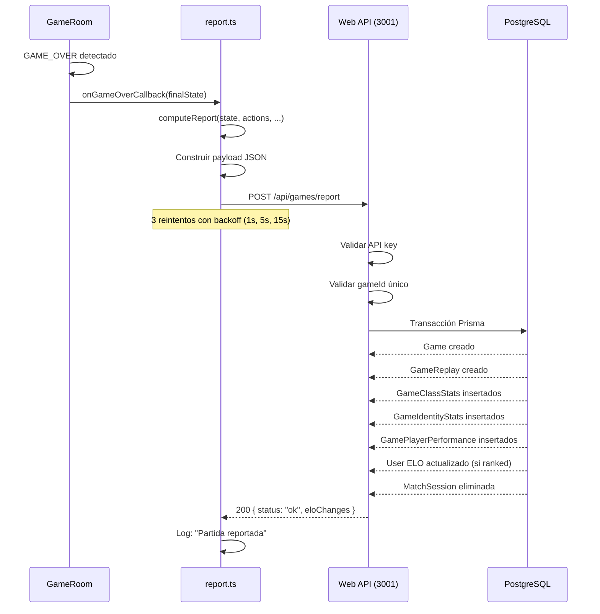

[docs](../docs.md) > [arquitectura](./index.md) > servidor

# 12. Persistencia

## Modelo de persistencia

El servidor de juego **no persiste datos directamente**. Toda la persistencia se delega a la web oficial (Next.js + Prisma + PostgreSQL) mediante peticiones HTTP.

```
Servidor Juego ──HTTP POST──▶ Web Oficial ──Prisma──▶ PostgreSQL
```

## Datos que se persisten

### Reporte post-partida

Cuando una partida termina, `submitReport()` envía un payload con toda la información de la partida a `POST /api/games/report`.

**Payload**:
```json
{
    "gameId": "a1b2c3d4",
    "winnerId": "uuid-del-ganador",
    "player1Id": "uuid-j1",
    "player2Id": "uuid-j2",
    "type": "ranked",
    "rngSeed": 12345,
    "actions": [
        { "index": 1, "playerId": "p1", "phase": "preparation", "turn": 1, "action": { "type": "SELECT_IDENTITY", ... } },
        { "index": 2, "playerId": "p2", "phase": "preparation", "turn": 1, "action": { "type": "SELECT_IDENTITY", ... } },
        ...
    ],
    "initialDeployments": [
        { "unitId": "u1", "unitClass": "cavalry", "playerId": "p1", "q": -2, "r": 1, "step": 0 },
        ...
    ],
    "gameHistory": [ ... ],
    "duration": 480,
    "totalTurns": 8,
    "deployment": { ... },
    "classStats": { "uuid-j1": [ { "unitClass": "archer", ... } ] },
    "identityStats": { "uuid-j1": { "identityId": "robin_hood", ... } },
    "performance": { "uuid-j1": { "score": 85, ... } }
}
```

### Tablas en PostgreSQL

| Tabla | Contenido | Propósito |
|-------|-----------|-----------|
| `User` | Usuarios registrados | Autenticación, ELO |
| `Game` | Cabecera de partida | id, jugadores, ganador, tipo, seed, duración, turnos |
| `GameReplay` | Actions + gameHistory | Reproducción de partidas |
| `GameClassStats` | Stats por clase | Análisis por clase de unidad |
| `GameIdentityStats` | Stats por identidad | Análisis por identidad |
| `GamePlayerPerformance` | Score de rendimiento | 10 métricas (0-100) |
| `QueueEntry` | Cola de matchmaking | Emparejamiento |
| `MatchSession` | Sesiones activas | Control de partidas en curso |
| `MatchPlayer` | Relación sesión↔usuario | Matchmaking |
| `PendingInvite` | Invitaciones pendientes | Sistema de amigos |

### Modelo Prisma (`web/prisma/schema.prisma`)

```prisma
model Game {
    id         String   @id
    player1Id  String
    player2Id  String
    winnerId   String?
    rngSeed    Int
    type       String   @default("quickplay")
    duration   Int?
    totalTurns Int?
    createdAt  DateTime @default(now())

    player1       User                    @relation("Player1", fields: [player1Id], references: [id])
    player2       User                    @relation("Player2", fields: [player2Id], references: [id])
    winner        User?                   @relation("Winner", fields: [winnerId], references: [id])
    replay        GameReplay?
    classStats    GameClassStats[]
    identityStats GameIdentityStats[]
    performances  GamePlayerPerformance[]
}

model GameReplay {
    gameId      String   @id
    rngSeed     Int
    actions     Json       // ActionRecord[]
    gameHistory Json?      // GameHistoryEntry[]
    createdAt   DateTime @default(now())
    game        Game     @relation(fields: [gameId], references: [id])
}
```

## Flujo de persistencia



## Consideraciones de integridad

### Idempotencia

El endpoint de reporte verifica si el `gameId` ya existe en la BD:

```typescript
const existing = await prisma.game.findUnique({ where: { id: gameId } });
if (existing) {
    return NextResponse.json({ error: 'Partida ya reportada' }, { status: 400 });
}
```

### Reintentos

Si la web oficial no está disponible, el servidor reintenta con backoff:

- Intento 1: 1s de espera
- Intento 2: 5s de espera
- Intento 3: 15s de espera
- Si todos fallan: se registra error y se abandona

### Gap de persistencia

Actualmente **no se persiste** `gameOverReason` en la tabla `Game`. La razón solo existe en el estado en memoria y en la acción `GAME_OVER` dentro de `actions[]`. Para futuras consultas, sería recomendable añadir este campo.

## Datos que NO se persisten

| Dato | Dónde está | Riesgo |
|------|-----------|--------|
| gameOverReason | Solo en acción GAME_OVER dentro de actions[] | Se pierde si no se parsean las acciones |
| Snapshots de estado | Solo en memoria del GameRoom | Se pierden al reiniciar el servidor |
| Estado actual (GameState) | Solo en memoria | Se pierde al reiniciar |
| Partidas en curso (MatchSession) | DB pero se limpian al reportar o expirar | OK — las sesiones expiran |
