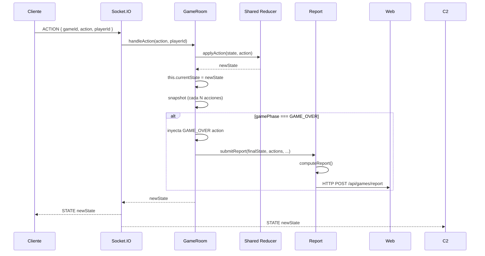
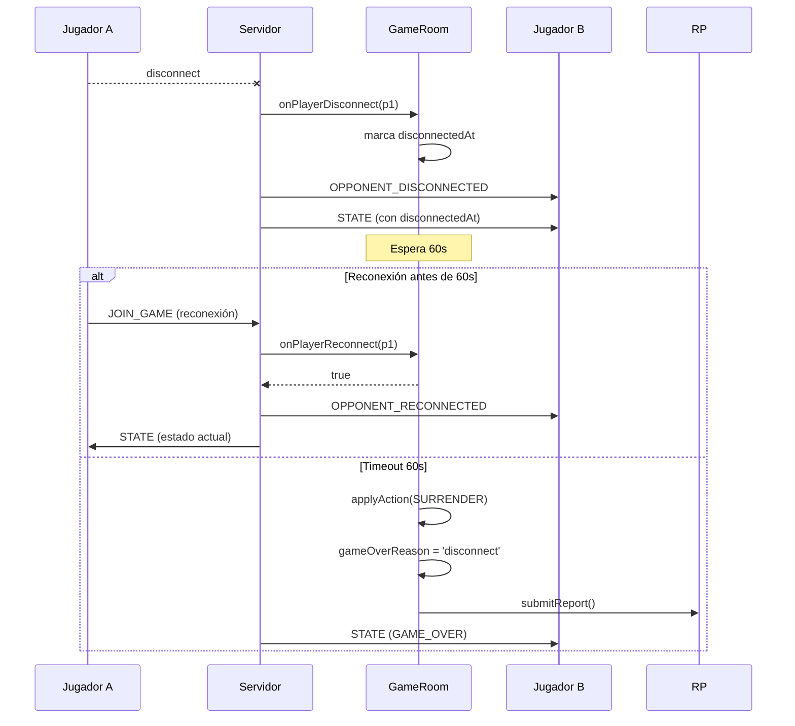

[docs](../docs.md) > [arquitectura](./index.md) > servidor

# 2. Arquitectura

## Diagrama de capas

```mermaid
graph TB
    subgraph "Cliente"
        CL["Cliente Juego (Vite 5173)
             socket.io-client"]
        WB["Web Oficial (Next.js 3001)
             socket.io-client"]
    end

    subgraph "Servidor Juego (3000)"
        direction TB
        IO["Socket.IO Server
            index.ts"]

        subgraph "Capa de Salas"
            RM["rooms.ts
                 Map<gameId, GameRoom>"]
            GR["GameRoom
                 - 2 jugadores + espectadores
                 - Acciones + Snapshots
                 - Timeout desconexión"]
        end

        subgraph "Capa de Juego (shared)"
            RE["reducer.ts
                 applyAction()"]
            PH["phases/
                 identity | roll | deployment | turn"]
            AC["actions/
                 move | attack | card | ability"]
            CO["combat/
                 resolver | kill | counter"]
            MO["modifiers/
                 engine"]
        end

        subgraph "Capa de Reporte"
            RP["report.ts
                 computeReport()
                 submitReport()"]
        end

        EP["/__emit (HTTP interno)"]

        IO --> RM
        RM --> GR
        GR --> RE
        RE --> PH
        RE --> AC
        AC --> CO
        AC --> MO
        GR --> RP
        RP -->|HTTP POST| WB
        IO --> EP
        EP -->|io.to(userId).emit| IO
    end

    subgraph "Persistencia"
        API["/api/games/report
             (Next.js API route)"]
        PG["PostgreSQL"]
        API --> PG
    end

    CL -->|Socket.IO| IO
    WB -->|Socket.IO| IO
    RP -->|POST /api/games/report| API
```

## Patrones de diseño

### 1. Event Sourcing (simplificado)

Cada acción del jugador se registra como un evento inmutable en `ActionRecord[]`. El estado actual se obtiene aplicando todos los eventos desde el inicio (con ayuda de snapshots para eficiencia).

```
Eventos: [DEPLOY_UNIT, MOVE_UNIT, ATTACK_UNIT, END_TURN, ...]
               │           │           │           │
               ▼           ▼           ▼           ▼
Estado:   State₀ ──▶ State₁ ──▶ State₂ ──▶ State₃ ──▶ ...
```

### 2. Reducer (Arquitectura Flux/Redux)

`applyAction(state, action) → newState` es una función pura que recibe el estado actual y una acción, y devuelve un nuevo estado. Esto permite:

- **Determinismo**: misma secuencia de acciones + misma seed RNG → mismo estado final
- **Replay**: reproducir la partida re-aplicando las acciones desde el inicio
- **Testing**: verificar comportamientos sin necesidad de red

### 3. Inmutabilidad

Todas las transformaciones de estado crean nuevos objetos. El `GameState` nunca se muta. Esto evita efectos secundarios y facilita el debugging.

### 4. Separación en capas

```
index.ts (IO) → GameRoom (orquestación) → shared (lógica pura) → report.ts (persistencia)
```

Cada capa tiene responsabilidades claras y no se salta la jerarquía.

## Tecnologías y justificación

| Tecnología | Por qué |
|-----------|---------|
| **TypeScript** | Tipado fuerte para modelo de dominio complejo (18 tipos de acción, 5 clases de unidad, 15 identidades) |
| **Socket.IO** | Tiempo real bidireccional con soporte de reconexión y rooms |
| **tsx** | Ejecución directa de TypeScript sin compilación previa, ideal para desarrollo |
| **Nodemon** | Hot reload automático al modificar archivos |
| **JWT** | Autenticación liviana sin estado para WebSocket |
| **Reducer puro** | Predecibilidad, testabilidad, capacidad de replay |

## Flujo principal



## Flujo de desconexión



## Mecanismo de snapshots

El servidor toma snapshots periódicos del estado para permitir la reconstrucción eficiente ante reconexiones.

```typescript
SNAPSHOT_EVERY_N_ACTIONS = 1;  // Cada acción (configurable)

// Al reconectar:
rebuildStateUpTo(actionIndex) {
    // 1. Buscar el snapshot más cercano ANTES del índice solicitado
    // 2. Re-aplicar acciones desde ese snapshot hasta el índice
    // 3. Devolver estado reconstruido
}
```

Con `SNAPSHOT_EVERY_N_ACTIONS = 1`, no se necesita rebuild — se sirve el snapshot exacto. Esto es intencional para desarrollo. En producción se podría espaciar a cada 5-10 acciones para ahorrar memoria.
