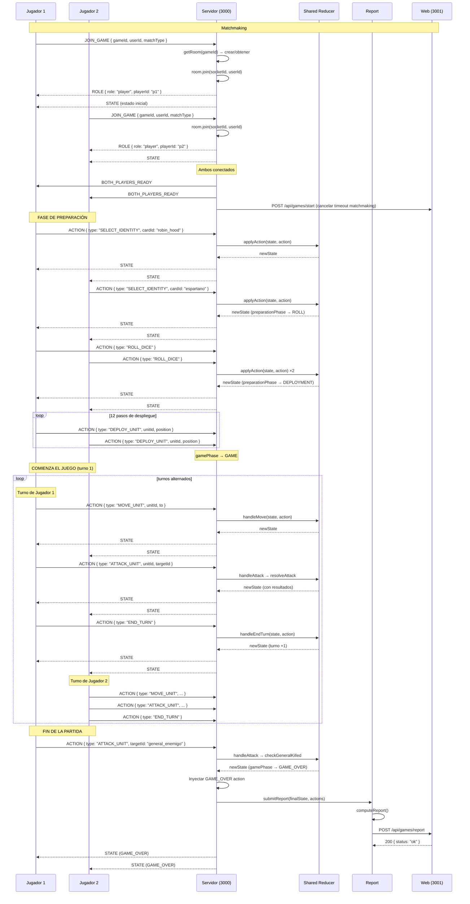
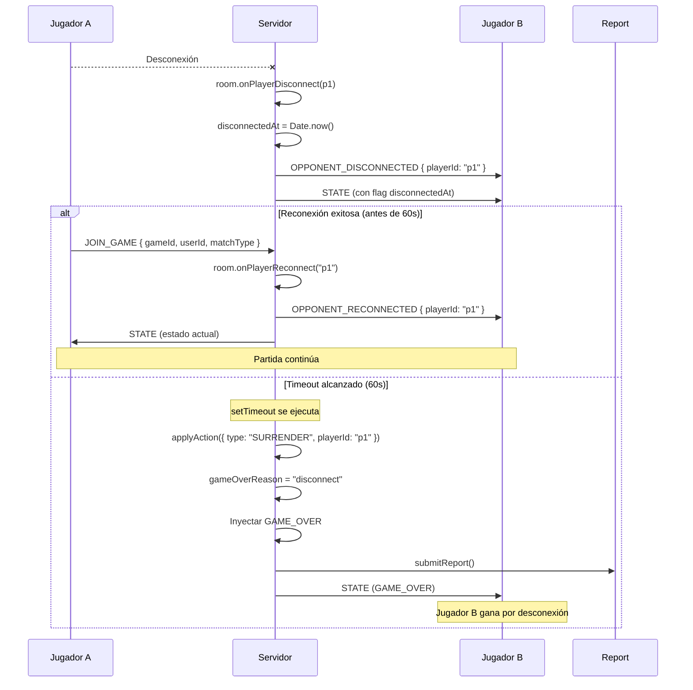
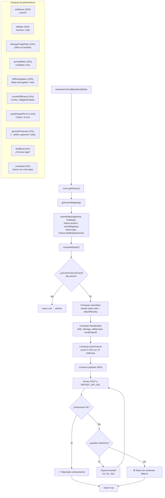
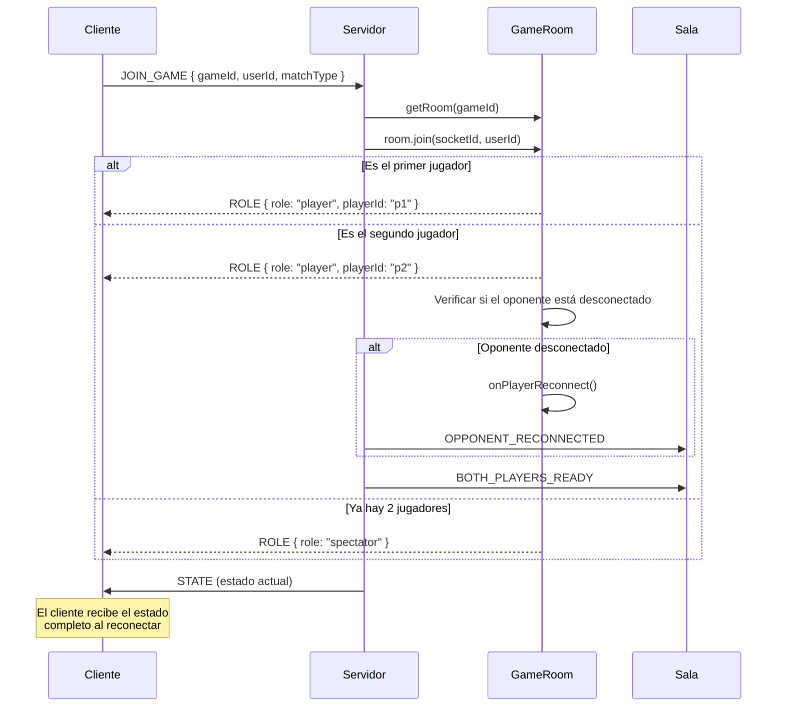
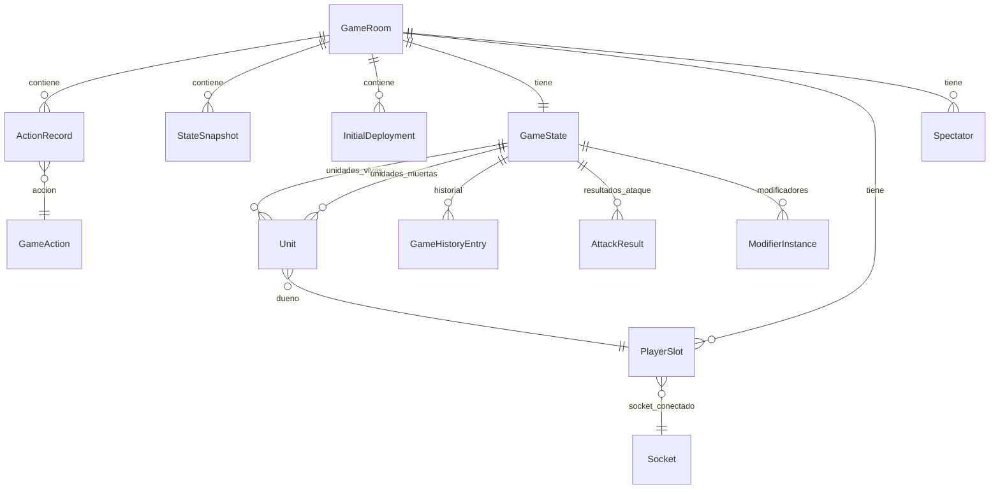

[docs](../docs.md) > [arquitectura](./index.md) > servidor

# 8. Diagramas técnicos

## 8.1 Diagrama de secuencia: Partida completa

## 8.2 Diagrama de flujo: Pipeline de acción

```mermaid
flowchart LR
    A["socket.on('ACTION')"] --> B{"room.isPlayer()?"}
    B -->|"No"| C["Ignorar"]
    B -->|"Sí"| D["room.handleAction()"]
    D --> E["Registrar ActionRecord<br/>(index, phase, turn, time)"]
    E --> F["¿DEPLOY_UNIT?"]
    F -->|"Sí"| G["Capturar InitialDeployment"]
    F -->|"No"| H["applyAction(state, action)"]
    G --> H
    H --> I["applyActionInner()"]
    I --> J{"Estado cambió?"}
    J -->|"No"| K["Devolver estado original"]
    J -->|"Sí"| L["Procesar lastAttackResult"]
    L --> M["¿gamePhase===GAME<br/>y hubo ataque?"]
    M -->|"Sí"| N["checkGeneralKilled()"]
    M -->|"No"| O["¿GAME + MAIN?"]
    N --> O
    O -->|"Sí"| P["refreshFormations()"]
    O -->|"No"| Q["Devolver newState"]
    P --> Q
    Q --> R["currentState = newState"]
    R --> S{"gamePhase ===<br/>GAME_OVER?"}
    S -->|"Sí"| T["Inyectar GAME_OVER action"]
    T --> U["onGameOverCallback()"]
    S -->|"No"| V["¿Snapshot?"]
    U --> V
    V -->|"Sí"| W["Guardar StateSnapshot"]
    V -->|"No"| X["Emitir STATE a la sala"]
    W --> X
```

## 8.3 Diagrama de secuencia: Desconexión y timeout

## 8.4 Diagrama de flujo: Reporte post-partida

## 8.5 Diagrama de flujo: Reconexión

## 8.6 Diagrama de entidad-relación (memoria)

