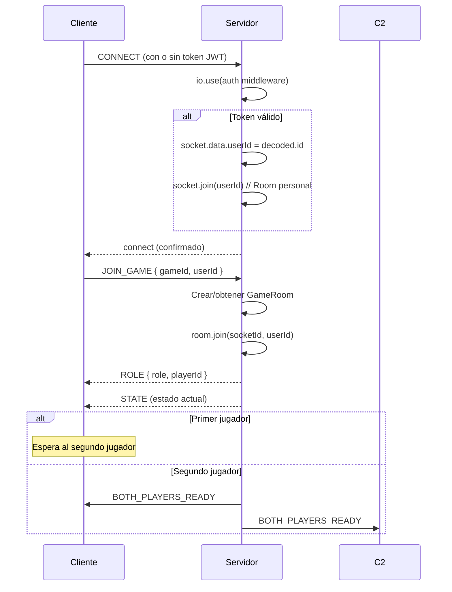

[docs](../docs.md) > [arquitectura](./index.md) > servidor

# 9. Protocolo cliente-servidor

## Transporte

La comunicación entre el cliente de juego y el servidor se realiza mediante **Socket.IO** (WebSocket con fallback HTTP).

- **URL del servidor**: `http://localhost:3000` (desarrollo) o URL configurada en producción
- **Autenticación**: JWT en `socket.handshake.auth.token` (opcional — sin token se conecta como cliente legacy)

## Mensajes entrantes (cliente → servidor)

### 1. JOIN_GAME

Unirse a una sala de partida.

```typescript
// Emitido por: Cliente
// Propósito: Unirse a una partida existente

socket.emit('JOIN_GAME', {
    gameId: string;      // ID de la partida (8 chars, UUID v4 truncado)
    userId?: string;     // ID del usuario (opcional, desde web)
    matchType?: 'quickplay' | 'ranked';  // Tipo de partida
});
```

**Respuestas**:
- `ROLE` → asigna rol al jugador
- `STATE` → estado actual de la partida
- `BOTH_PLAYERS_READY` → cuando ambos jugadores están conectados

### 2. ACTION

Enviar una acción de juego.

```typescript
// Emitido por: Cliente (jugador)
// Propósito: Realizar una acción durante la partida

socket.emit('ACTION', {
    gameId: string;
    action: GameAction;  // Una de las 18 variantes
    playerId: 'p1' | 'p2';
});
```

**Validaciones del servidor**:
1. El socket debe pertenecer al `playerId` indicado
2. La acción se valida dentro del handler correspondiente

**Respuestas**:
- `STATE` → nuevo estado después de aplicar la acción

### 3. SURRENDER

Rendirse en una partida.

```typescript
socket.emit('SURRENDER', {
    gameId: string;
    playerId: 'p1' | 'p2';
});
```

Equivalente a `ACTION { type: 'SURRENDER', playerId }`.

### 4. LEAVE_GAME

Abandonar una partida (sin rendirse — solo para espectadores).

```typescript
socket.emit('LEAVE_GAME', {
    gameId: string;
});
```

**Respuestas**:
- `LEFT_GAME` → confirmación de salida

### 5. disconnect

Desconexión del socket (manejada automáticamente por Socket.IO).

```typescript
// No se emite explícitamente — Socket.IO lo maneja
socket.on('disconnect', () => { ... });
```

## Mensajes salientes (servidor → cliente)

### 1. ROLE

Asignación de rol al unirse a una partida.

```typescript
// Recibido por: Cliente
// Propósito: Informar al cliente qué rol tiene en la partida

socket.on('ROLE', (data: {
    role: 'player';
    playerId: 'p1' | 'p2';
} | {
    role: 'spectator';
}));
```

### 2. STATE

Estado actualizado de la partida (después de cada acción).

```typescript
// Recibido por: Todos los sockets en la sala
// Propósito: Sincronizar el estado del juego

socket.on('STATE', (state: GameState));
```

El `GameState` completo incluye: unidades, jugadores, fase, turno, historial, modificadores, etc.

### 3. BOTH_PLAYERS_READY

Ambos jugadores están conectados.

```typescript
socket.on('BOTH_PLAYERS_READY');
```

### 4. OPPONENT_DISCONNECTED

El oponente se desconectó (inicia temporizador de 60s).

```typescript
socket.on('OPPONENT_DISCONNECTED', (data: {
    playerId: 'p1' | 'p2';  // Jugador desconectado
}));
```

### 5. OPPONENT_RECONNECTED

El oponente se reconectó (dentro de los 60s).

```typescript
socket.on('OPPONENT_RECONNECTED', (data: {
    playerId: 'p1' | 'p2';  // Jugador reconectado
}));
```

### 6. LEFT_GAME

Confirmación de salida de la sala.

```typescript
socket.on('LEFT_GAME');
```

## Protocolo interno (servidor → servidor)

### `/__emit` (HTTP POST)

Endpoint interno para que la web oficial emita eventos Socket.IO a usuarios específicos.

```typescript
// Llamado por: Web oficial (HTTP)
// Propósito: Notificar a un usuario vía Socket.IO

POST /__emit
Content-Type: application/json

{
    "userId": "uuid-del-usuario",
    "event": "match_found" | "invite" | "invite_cancelled" | "invite_accepted",
    "data": { ... }  // Datos del evento
}
```

**Eventos emitidos**:

| Evento | Propósito | Datos |
|--------|-----------|-------|
| `match_found` | Se encontró partida | `{ gameId, opponent }` |
| `invite` | Invitación recibida | `{ id, inviterName, gameId }` |
| `invite_cancelled` | Invitación cancelada | `{ inviteId }` |
| `invite_accepted` | Invitación aceptada | `{ gameId, invitedName }` |

## Secuencia de conexión



## Tipos compartidos

Los tipos del protocolo se definen en:
- `src/shared/game/action-types.ts` — `GameAction`
- `src/shared/game/state.ts` — `GameState`
- `src/server/GameRoom.ts` — `ActionRecord`, `PlayerSlot`
