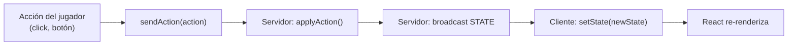

[docs](../docs.md) > frontend > descripcion

# Descripción de pantallas — Shadow Tactics

## Stack

| Capa | Tecnología |
|------|-----------|
| Frontend | React 18.2 + TypeScript 5.4 |
| Build | Vite 5 |
| Estilos | Tailwind CSS 4 |
| Tiempo real | Socket.IO 4.8 |
| Navegación | Condicional en `App.tsx` (sin router) |

## Web oficial

El juego tendrá una **web oficial** independiente del cliente de juego. Esta web será el punto de entrada para los usuarios e incluirá:

- **Página principal** con presentación del juego, noticias y enlaces
- **Cómo jugar** — tutoriales, reglas, descripción de cartas y unidades
- **Registro de usuarios** — cuentas, autenticación, perfil
- **Rankings** — clasificación competitiva, historial de partidas, estadísticas
- **Tienda** — cosméticos, skins, efectos visuales

La web oficial enlazará al cliente de juego, ya sea para **crear salas privadas** (Game ID) o mediante un **sistema de emparejamiento** (_matchmaking_) para juego competitivo.

Ver [`weboficial.md`](./weboficial.md) para la especificación completa.

## Arquitectura de estados

Cada pantalla recibe `GameState` completo desde el servidor vía Socket.IO.
El cliente **nunca** muta el estado localmente — toda acción se envía al servidor,
que la procesa con `applyAction()` y retransmite el nuevo estado completo a todos los clientes.



---

## Índice de pantallas

| # | Pantalla | Fase | Estado |
|---|----------|------|--------|
| 1 | Lobby / Conexión | — | ✅ Implementada |
| 2 | Preparación | `PREPARATION` | ❎ Pendiente — ver [`pantalla-preparacion.md`](./pantalla-preparacion.md) |
| 3 | Juego — DRAW | `DRAW` | ❎ Pendiente |
| 4 | Juego — MAIN | `MAIN` | ⚠️ Parcial |
| 5 | Juego — COUNTER | `COUNTER` | ❎ Pendiente |
| 6 | Juego — Game Over | `GAME_OVER` | ❎ Pendiente |

---

## 1. Lobby / Conexión

**Estado:** `gameId === null`

Pantalla inicial. El jugador introduce un ID de sala y se conecta.

### Elementos

| Elemento | Tipo | Comportamiento |
|----------|------|---------------|
| Indicador de conexión | Texto | "Connecting..." / "Connected" |
| Input Game ID | `input[type=text]` | ID de sala a unir |
| Botón "Join Game" | `button` | Emite `JOIN_GAME { gameId }` |
| Indicador de rol | Texto | Aparece tras recibir `ROLE` |

### Flujo

```
App.tsx
  └─ gameId === null
       ├─ "Conectando..." (connected === false)
       └─ Input + Botón "Join Game" (connected === true)
            └─ joinGame(id)
                 └─ socket.emit('JOIN_GAME', { gameId })
                      └─ servidor responde ROLE + STATE
                           └─ gameId queda seteado → pantalla de juego
```

### Archivos

- `src/client/App.tsx` — render condicional
- `src/client/game/useGameState.ts` — lógica de conexión
- `src/client/net/socket.ts` — instancia Socket.IO

---

## 2. Selección de identidad

**Estado:** `gamePhase === 'PREPARATION' && preparationPhase === 'IDENTITY_SELECTION'`

Cada jugador recibe 3 cartas de identidad y elige 1.

### Elementos

| Elemento | Tipo | Comportamiento |
|----------|------|---------------|
| Estado de espera | Texto | "Esperando jugadores..." hasta recibir `BOTH_PLAYERS_READY` |
| Mano de 3 cartas | Grid horizontal | Muestra `identityCards[]` con nombre y clase |
| Carta destacada | Highlight borde azul | Click → muestra info en panel derecho (no selecciona) |
| Botón "Seleccionar carta" | `button` | Deshabilitado hasta destacar carta. Emite `SELECT_IDENTITY { cardId }` |
| Panel derecho | Aside | Ilustración (placeholder), nombre, clase, descripción |
| Estado del rival | Texto | "Esperando al oponente..." |

### Flujo

```
IDENTITY_SELECTION
  └─ ¿bothPlayersReady?
       No → "Esperando jugadores..." (sin cartas)
       Sí → Mostrar 3 cartas de identityCards[]
  └─ Jugador clicka carta → se destaca (borde azul)
       → Panel derecho muestra info + ilustración
  └─ Botón "Seleccionar carta" → sendAction({ type: 'SELECT_IDENTITY', cardId })
  └─ Carta confirmada → borde verde + check. Botón deshabilitado
  └─ "Esperando al oponente..."
  └─ Ambos confirmaron → avanza a ROLL
```

### Eventos de servidor

| Evento | Cuándo |
|--------|--------|
| `BOTH_PLAYERS_READY` | Segundo jugador se conecta a la sala |

### Archivos relacionados

- `src/shared/game/state.ts` — `identityCards[]`, `selectedIdentity`
- `src/shared/game/phases/identity.ts` — `handleIdentity()`
- `src/client/prep/IdentitySelection.tsx` — componente React
- `src/client/game/useGameState.ts` — hook con flag `bothPlayersReady`
- `src/server/index.ts` — emisión de `BOTH_PLAYERS_READY`

---

## 3. Tirada de dados

**Estado:** `gamePhase === 'PREPARATION' && preparationPhase === 'ROLL'`

Cada jugador tira 2d6. El que saca mayor puntuación es jugador activo.

### Elementos propuestos

| Elemento | Tipo | Comportamiento |
|----------|------|---------------|
| Botón "Tirar dados" | `button` | Emite `ROLL_DICE` (solo una vez) |
| Resultado propio | Display | Muestra los 2 dados + suma |
| Resultado rival | Display | "Esperando tirada..." o el resultado |
| Indicador de empate | Overlay | "Empate — volver a tirar" |

### Flujo

```
ROLL
  └─ Botón "Tirar dados" → sendAction({ type: 'ROLL_DICE' })
  └─ state.diceRolls[p1] se actualiza
  └─ Ambos tiraron:
       ├─ Empate: mensaje + ambos resetean → tirar de nuevo
       └─ No empate: mostrar quién despliega primero y quién es activo
            └─ Avanza a DEPLOYMENT automáticamente
```

### Archivos relacionados

- `src/shared/game/phases/roll.ts` — `handleRoll()`

---

## 4. Despliegue

> Las subfases previas (`IDENTITY_SELECTION` y `ROLL`) se manejan en
> [`pantalla-preparacion.md`](./pantalla-preparacion.md). El despliegue
> ocurre en el **HexBoard en modo `DEPLOYMENT`**, el mismo tablero que
> se usa durante el juego.

**Estado:** `gamePhase === 'PREPARATION' && preparationPhase === 'DEPLOYMENT'`

Los jugadores colocan sus 11 unidades alternando turnos (patrón 1-2-2-...-2-1).

### HexBoard: dos modos

| Modo | preparationPhase / gamePhase | Interacción |
|------|------------------------------|-------------|
| `DEPLOYMENT` | `PREPARATION` / `DEPLOYMENT` | Colocar unidades del pool en hexes válidos |
| `GAME` | `GAME` | Mover, atacar, jugar cartas (juego normal) |

El componente recibe un prop `mode` que cambia el comportamiento:

```typescript
<HexBoard state={state} sendAction={sendAction}
    mode={state.gamePhase === 'PREPARATION' ? 'DEPLOYMENT' : 'GAME'} />
```

### Elementos

| Elemento | Tipo | Comportamiento |
|----------|------|---------------|
| Panel de pool de unidades | Sidebar/lista | Muestra `unitsToDeploy[]` con clase y stats |
| Tablero hexagonal | SVG (HexBoard) | Mismo SVG que el juego, con overlays de colocación |
| Unidad seleccionada del pool | Highlight | Click en unidad del pool → cursor en modo "colocar" |
| Hex reachable | Overlay verde | Hexes válidos según reglas de despliegue |
| Hex ocupado | Overlay rojo | Hexes con unidades ya colocadas |
| Colocación | Click en hex reachable | Emite `DEPLOY_UNIT { unitId, position, class }` |
| Indicador de paso | Header/barra | "Paso 3/12 — Colocando 2 unidades" |
| Pool restante | Texto | "Unidades por colocar: 8/11" |
| Turno del rival | Overlay | "Esperando que el oponente coloque..." — tablero solo lectura |

### Reglas de validación visual

| Regla | Visual |
|-------|--------|
| Primera unidad: distancia exactamente 2 del centro | Solo hexes con distancia 2 son reachables |
| Siguientes: distancia ≤ 2 de aliado | Hexes a ≤ 2 de unidades aliadas ya colocadas |
| Clase repetida > 3 | Clase aparece atenuada en el pool |
| Máximo 1 general | Ícono especial, advertencia si se intenta duplicar |
| Última unidad sin general | "¡Debes colocar al general!" |

### Flujo

```
1. preparationPhase cambia a 'DEPLOYMENT'
2. App.tsx renderiza HexBoard con mode='DEPLOYMENT'
3. Si es mi turno (currentDeployingPlayer === role.playerId):
     a. Click en unidad del pool → se selecciona
     b. Hexes válidos se iluminan en verde
     c. Click en hex reachable → sendAction({ type: 'DEPLOY_UNIT', ... })
     d. Unidad pasa a deployedUnits[], avanza al siguiente paso
4. Si no es mi turno:
     a. Tablero solo lectura (clicks ignorados)
     b. Mensaje "Esperando que el oponente coloque..."
5. Step 11 completado → gamePhase = 'GAME' → transición automática a modo juego
```

### Archivos relacionados

- `src/shared/game/phases/deployment.ts` — `handleDeployment()`
- `src/shared/game/state.ts` — `deploymentStep`, `deploymentCount`, `unitsToDeploy[]`
- `src/shared/game/init.ts` — pool inicial de unidades
- `src/client/game/board/HexBoard.tsx` — tablero (modo `DEPLOYMENT`)
- `src/client/game/board/UnitPool.tsx` — panel lateral de pool (nuevo)

---

## 5. Juego — DRAW

**Estado:** `gamePhase === 'GAME' && turnPhase === 'DRAW'`

Subfase automática. Se ejecutan:
1. Calcular PA = min(5 + carryOver, 8)
2. Resetear tracking de habilidades por unidad
3. Robar 1 carta del mazo
4. Procesar modificadores activos
5. Si mano > 3 → esperar `DISCARD_CARD`

### Elementos propuestos

| Elemento | Tipo | Comportamiento |
|----------|------|---------------|
| Animación de robo | Toast/Notificación | "Has robado: [nombre carta]" |
| Mano de cartas | Barra inferior | Muestra `cardsInHand[]` |
| Modal de descarte | Overlay | Si mano > 3: mostrar las 4 cartas, jugador elige 1 para descartar |
| Botón "Descartar" | `button` | Emite `DISCARD_CARD { cardId }` |
| Modificadores activos | Indicador | Muestra debuffs/buffs activos en el jugador |

### Flujo DRAW (mano ≤ 3)

```
applyTurnStart()
  └─ Calcular PA, resetear tracking, robar carta
  └─ Mano ≤ 3 → turnPhase = MAIN automáticamente
```

### Flujo DRAW (mano > 3)

```
applyTurnStart()
  └─ Mano > 3 → turnPhase = DRAW
  └─ Solo DISCARD_CARD aceptado
  └─ Jugador elige carta → sendAction({ type: 'DISCARD_CARD', cardId })
  └─ Mano vuelve a 3 → turnPhase = MAIN
```

---

## 6. Juego — MAIN

**Estado:** `gamePhase === 'GAME' && turnPhase === 'MAIN' && activePlayer === role.playerId`

Fase principal. El jugador activo tiene control total: mover, atacar, usar habilidades, jugar cartas.

### Elementos propuestos

| Elemento | Tipo | Comportamiento |
|----------|------|---------------|
| **Tablero hexagonal** | SVG | Hexágonos + unidades + overlays |
| **Overlay de reachable** | Hexágonos verdes | Al seleccionar unidad, muestra a qué hex puede moverse |
| **Overlay de ataque** | Hexágonos rojos | Al seleccionar unidad o pulsar "Atacar", muestra enemigos en rango |
| **Overlay de carta** | Hexágonos azules | Al seleccionar carta con target, muestra objetivos válidos |
| **Barra de unidades** | Lista horizontal | Miniaturas de todas las unidades del jugador con HP |
| **Mano de cartas** | Barra inferior | Cartas en mano, click para jugar |
| **Panel de unidad seleccionada** | Sidebar/detalle | HP, ataque, dificultad, rango, clase, modificadores activos |
| **Botón "Terminar turno"** | `button` | Emite `END_TURN` |
| **Indicador de PA** | Barra numérica | "PA: 5/8" |
| **Indicador de turno** | Header | "Turno 3 — P1" |
| **HUD superior** | Barra | Fase actual, turno, jugador activo |

### Sub-interacciones

#### Mover

```
1. Click en unidad propia → seleccionar
2. Mostrar hexes reachables (movementRange)
3. Click en hex reachable → sendAction({ type: 'MOVE_UNIT', unitId, to })
```

#### Atacar

```
1. Click en unidad propia → seleccionar
2. Click en "Atacar" o click en unidad enemiga
3. Validar rango → sendAction({ type: 'ATTACK_UNIT', unitId, targetId })
4. Mostrar resultado (hit/miss, daño, contraataque)
```

#### Usar habilidad

```
1. Click en unidad propia → seleccionar
2. Click en botón de habilidad (si PA suficiente y no usada)
3. Si requiere target → click en objetivo
4. sendAction({ type: 'USE_ABILITY', unitId, abilityId, targetId? })
```

#### Jugar carta

```
1. Click en carta de la mano → seleccionar
2. Si requiere target (Confusión) → click en unidad objetivo
3. Confirmar → sendAction({ type: 'USE_CARD', cardId, targetId? })
4. Estado pasa a COUNTER automáticamente (si el rival responde)
```

### Archivos

- `src/client/game/board/HexBoard.tsx` — tablero SVG
- `src/client/game/board/UnitsLayer.tsx` — render de unidades
- `src/client/game/board/HexTile.tsx` — hexágono individual
- `src/client/game/board/movementRange.ts` — cálculo de reachables
- `src/client/game/board/useBoardInteraction.ts` — selección/hover

---

## 7. Juego — COUNTER

**Estado:** `gamePhase === 'GAME' && turnPhase === 'COUNTER'`

Subfase opcional. Cuando el jugador activo juega una carta BUFF/DEBUFF,
el rival tiene oportunidad de responder.

### Elementos propuestos

| Elemento | Tipo | Comportamiento |
|----------|------|---------------|
| Notificación | Overlay/toast | "¡Oportunidad de contrajuego!" |
| Cartas COUNTER del rival | Highlight | Solo las cartas COUNTER válidas se muestran jugables |
| Botón "Pasar" | `button` | Emite `PASS_COUNTER` → la carta pendiente se resuelve |
| Indicador de carta pendiente | Texto | "Carta pendiente: [nombre] — [BUFF/DEBUFF]" |
| Restricción visual | Opacidad | Las cartas COUNTER no válidas aparecen grisadas |

### Restricciones (validación en servidor)

| Carta pendiente | COUNTERs válidos |
|----------------|-----------------|
| BUFF | Solo Ladrón |
| DEBUFF | Ladrón, Espejo, Panacea |

### Flujo

```
USE_CARD (BUFF/DEBUFF) → turnPhase = COUNTER
  └─ Si es el turno del rival (activePlayer):
       ├─ Botón "Pasar" → PASS_COUNTER → se resuelve la carta → MAIN
       ├─ "Ladrón" → roba carta pendiente → MAIN
       ├─ "Espejo" (solo DEBUFF) → refleja debuff → MAIN
       └─ "Panacea" (solo DEBUFF) → elimina debuffs propios → MAIN
  └─ Si es el turno del activo:
       └─ No puede hacer nada (sus acciones se rechazan)
```

---

## 8. Juego — Game Over

**Estado:** `gamePhase === 'GAME_OVER'`

### Elementos propuestos

| Elemento | Tipo | Comportamiento |
|----------|------|---------------|
| Overlay de victoria/derrota | Overlay | "¡Has ganado!" / "Has perdido" |
| Nombre del ganador | Texto | `state.winner` |
| Botón "Volver al lobby" | `button` | Resetea estado, vuelve a lobby |
| Tablero congelado | SVG | Muestra estado final del tablero (solo visual) |

### Disparador

```
killUnit():
  └─ unit.class === 'general'
       └─ gamePhase = 'GAME_OVER'
       └─ winner = atacante
```

---

## Componentes comunes

Estos componentes son reutilizables entre pantallas.

### Barra de cartas en mano

```
┌─────────────────────────────────────────────────────┐
│  [Carta 1]  [Carta 2]  [Carta 3]  ← click para jugar │
│  Mano: 3/3                        PA: 5/8            │
└─────────────────────────────────────────────────────┘
```

Estados: `default`, `selected` (highlight), `disabled` (no se puede jugar), `counter-valid` (verde, válido en COUNTER), `counter-invalid` (gris, no válido en COUNTER).

### Panel de unidad

```
┌──────────────────┐
│  Arquero         │
│  HP: ████░░ 8/8  │
│  Atq: 3          │
│  Def: 6+dist     │
│  Rango: 4        │
│  PA coste mov: 2 │
│  [Mover] [Atacar]│
│  [Habilidad ▼]   │
└──────────────────┘
```

Estados: `default` (no seleccionada), `selected` (panel abierto), `enemy` (información del enemigo seleccionado).

### Overlay de resultado

```
┌──────────────────────────┐
│  ¡Ataque!                │
│  2d6: 4 + 5 = 9          │
│  Dificultad: 7            │
│  ✅ ¡Acierto!             │
│  Daño: 3 → 8 HP restantes │
│  [Cerrar]                 │
└──────────────────────────┘
```

---

## Estado actual de implementación

| Componente | Archivo(s) | Estado |
|-----------|-----------|--------|
| Lobby | `App.tsx` | ✅ Funcional |
| Lobby | `App.tsx` | ✅ Funcional |
| Tablero SVG | `HexBoard.tsx`, `HexTile.tsx` | ✅ Funcional |
| Render de unidades | `UnitsLayer.tsx` | ✅ Funcional |
| Reachable hexes | `movementRange.ts` | ✅ Funcional |
| Movimiento (click-to-move) | `HexBoard.tsx` | ✅ Funcional |
| Debug panel | `DebugPanel.tsx`, `DebugEntry.tsx` | ✅ Funcional |
| `myPlayerId` hardcodeado a `'p1'` | `HexBoard.tsx` | ⚠️ Parche temporal |
| Zoom/pan del tablero | `useViewport.ts` | ✅ Funcional |
| Mouse hover/selection | `useBoardInteraction.ts` | ✅ Funcional |
| Pantalla de preparación | `PreparationScreen.tsx` | ❎ Pendiente |
| Selección de identidad | `IdentitySelection.tsx` | ❎ Pendiente |
| Tirada de dados | `DiceRoll.tsx` | ❎ Pendiente |
| Despliegue en tablero | `HexBoard.tsx` (modo `DEPLOYMENT`) + `UnitPool.tsx` | ❎ Pendiente |
| Barra de cartas | — | ❎ Pendiente |
| Panel de unidad | — | ❎ Pendiente |
| Overlay de ataque | — | ❎ Pendiente |
| Overlay de COUNTER | — | ❎ Pendiente |
| Overlay de Game Over | — | ❎ Pendiente |
| UI de Descarte (DRAW) | — | ❎ Pendiente |

---

## Próximos pasos

Prioridad sugerida:

1. **Pantalla de preparación** (identidad + dados) — primera pantalla tras join
2. **Despliegue en tablero** (HexBoard modo DEPLOYMENT) — necesario para comenzar partidas
3. **Barra de cartas en mano** — necesario para probar USE_CARD
4. **Panel de unidad** — necesario para ver stats y atacar
5. **Overlay de ataque** — necesario para probar combate
6. **Overlay de COUNTER** — necesario para probar flujo COUNTER completo
7. **UI de DRAW (descarte)** — necesario para probar límite de mano
8. **UI de Game Over** — necesario para cerrar el ciclo de juego
