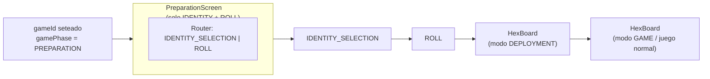

[docs](../docs.md) > frontend > pantalla-preparacion

# Pantalla de preparación

Pantalla que se muestra tras unirse a una sala (`gameId` seteado) y antes de
la partida. Se encarga de la selección de identidad y la tirada de dados.
El despliegue ocurre en el tablero (HexBoard en modo `DEPLOYMENT`).

## Estado

```
gamePhase === 'PREPARATION'
```

Dentro de PREPARATION hay 3 subfases. Esta pantalla maneja las 2 primeras;
el despliegue se realiza en el tablero (HexBoard en modo `DEPLOYMENT`).

| Subfase | preparationPhase | Dónde se maneja |
|---------|------------------|-----------------|
| Selección de identidad | `IDENTITY_SELECTION` | PreparationScreen |
| Tirada de dados | `ROLL` | PreparationScreen |
| Despliegue | `DEPLOYMENT` | HexBoard (modo despliegue) |

## Arquitectura



El componente `App.tsx` renderiza condicionalmente:

```
gameId === null                     → Lobby
gamePhase === PREPARATION
  ├─ IDENTITY_SELECTION | ROLL      → PreparationScreen
  └─ DEPLOYMENT                     → HexBoard (modo despliegue)
gamePhase === GAME                  → HexBoard (modo juego)
gamePhase === GAME_OVER             → HexBoard (congelado + overlay)
```

### Código en App.tsx

```typescript
{gameId ? (
    role && state && state.gamePhase === 'PREPARATION'
        && state.preparationPhase !== 'DEPLOYMENT' ? (
        <PreparationScreen
            state={state}
            sendAction={sendAction}
            role={role}
            bothPlayersReady={bothPlayersReady}
        />
    ) : (
        <div className="grid grid-cols-[320px_1fr]">
            {state ? (
                <HexBoard state={state} sendAction={sendAction} />
            ) : (
                <div>Waiting for game state…</div>
            )}
            <DebugPanel />
        </div>
    )
) : /* lobby */}
```

El tablero recibe un prop `phase` para cambiar de comportamiento entre despliegue
y juego normal.

---

## 1. Subfase: IDENTITY_SELECTION

**Estado:** `preparationPhase === 'IDENTITY_SELECTION'`

Cada jugador ve sus 3 cartas de identidad y elige 1.

### Layout

```
┌─────────────────────────────────────────────────────────────┐
│  Shadow Tactics                [sala-123 · p1]     Leave    │
├─────────────────────────────────────────────────────────────┤
│  Selecciona tu identidad                                    │
├──────────────────────────────────────┬──────────────────────┤
│                                      │  Detalles            │
│                                      │  ┌────────────────┐  │
│  [🛡️]  [🛡️]  [🛡️]                  │  │     🛡️         │  │
│  Robin  Francoti  Dios               │  │  ilustración    │  │
│  Hood   rador     Trueno             │  └────────────────┘  │
│  Arquero Arquero  Infantería         │                       │
│                                      │  Robin Hood          │
│      [ Seleccionar carta ]           │  Arquero             │
│                                      │                       │
│  Haz clic en una carta...            │  +1 ataque a         │
│                                      │  distancia...        │
└──────────────────────────────────────┴──────────────────────┘
```

### Estados de la pantalla

| Estado | Visibilidad |
|--------|-------------|
| `bothPlayersReady === false` | Mensaje "Esperando jugadores..." — sin cartas |
| Sin carta destacada | 3 cartas en estado **default**. Panel derecho muestra "Haz clic en una carta..." |
| Carta destacada | Borde azul en la carta. Panel derecho muestra info + ilustración. Botón "Seleccionar carta" habilitado |
| Carta confirmada | Borde verde + "✓ SELECCIONADA". Botón y clicks deshabilitados. Panel muestra la carta elegida |
| Ambos confirmaron | "Ambos listos — continuando..." |

### Elementos

| Elemento | Tipo | Comportamiento |
|----------|------|---------------|
| Indicador de espera | Texto | "Esperando a que el segundo jugador se conecte..." (solo si falta jugador) |
| Título | Texto | "Selecciona tu identidad" |
| 3 cartas de identidad | Grid horizontal | Muestra `identityCards[]` con nombre + clase |
| Carta destacada | Highlight borde azul | Click → destaca la carta y muestra info en panel derecho (no selecciona aún) |
| Botón "Seleccionar carta" | `button` | Deshabilitado hasta destacar una carta. Emite `SELECT_IDENTITY { cardId }` |
| Panel derecho (sidebar) | Aside 288px | Muestra ilustración, nombre, clase y descripción de la carta destacada o seleccionada |
| Estado del rival | Texto | "Esperando a que el oponente elija..." o "Ambos listos" |

### Flujo

```
1. Llega STATE con preparationPhase = 'IDENTITY_SELECTION'
2. ¿Ambos jugadores conectados?
     No  → "Esperando jugadores..." (sin cartas)
     Sí  → Renderizar las 3 cartas
3. Jugador clicka una carta → se DESTACA (borde azul)
     → Panel derecho muestra: ilustración + nombre + clase + descripción
4. Botón "Seleccionar carta" se habilita
5. Jugador presiona botón → sendAction({ type: 'SELECT_IDENTITY', cardId })
6. Carta se marca como confirmada (borde verde + check)
7. "Esperando a que el oponente elija..."
8. Ambos confirmaron → preparationPhase cambia a 'ROLL'
```

### Datos necesarios del estado

```typescript
state.players[playerId].identityCards     // string[] — 3 card IDs
state.players[playerId].selectedIdentity  // string | undefined
state.players[playerId].revealedIdentity  // boolean
```

### Eventos de servidor

| Evento | Cuándo | Payload |
|--------|--------|---------|
| `BOTH_PLAYERS_READY` | El segundo jugador se conecta a la sala | — |

El cliente expone `bothPlayersReady` desde `useGameState()`.
Mientras es `false`, la pantalla no muestra las cartas.

---

## 2. Subfase: ROLL

**Estado:** `preparationPhase === 'ROLL'`

Cada jugador tira 2d6 para determinar orden de despliegue y jugador activo.

### Layout

```
┌─────────────────────────────────────────────────────────────┐
│  Shadow Tactics                   [sala-123 · p1]  Leave    │
├─────────────────────────────────────────────────────────────┤
│                                                             │
│                    Tirada de dados                          │
│                    ──────────────                           │
│                                                             │
│                    ┌───────────┐                            │
│                    │  🎲  🎲   │                            │
│                    │   4   5   │                            │
│                    │   = 9    │                            │
│                    └───────────┘                            │
│                                                             │
│                    [  Tirar dados  ]                        │
│                                                             │
│              Tu resultado: 9                                 │
│              Oponente: 7                                    │
│              → Tú eres el jugador activo                    │
│              → El oponente despliega primero                │
│                                                             │
└─────────────────────────────────────────────────────────────┘
```

### Elementos

| Elemento | Tipo | Comportamiento |
|----------|------|---------------|
| Título | Texto | "Tirada de dados" |
| Dados animados | Visual | 2 dados con animación de tirada (opcional) |
| Resultado propio | Display | Suma de 2d6 después de tirar |
| Resultado del rival | Display | "Esperando..." o el resultado |
| Botón "Tirar dados" | `button` | Emite `ROLL_DICE`. Se deshabilita tras la tirada |
| Indicador de empate | Overlay/mensaje | "¡Empate! Volver a tirar" → botón se re-habilita |
| Resumen final | Texto | Tras resolución: quién es activo, quién despliega primero |

### Estados de la subfase

| Estado | Visibilidad |
|--------|-------------|
| Sin tirar | Botón "Tirar dados" habilitado |
| Tiró propio, espera rival | Botón deshabilitado, muestra resultado propio + "Esperando oponente..." |
| Ambos tiraron, no empate | Muestra ambos resultados + quién es activo. Transición automática a DEPLOYMENT |
| Empate | Mensaje "¡Empate!" + botón se re-habilita |

### Flujo

```
1. preparationPhase cambia a 'ROLL'
2. Jugador ve botón "Tirar dados"
3. Click → sendAction({ type: 'ROLL_DICE' })
4. state.diceRolls se actualiza
5. Si el otro jugador ya tiró:
     a. Empate: se resetean ambos → volver a tirar
     b. No empate: mostrar resultado, esperar 2-3s, avanza a DEPLOYMENT
6. Si el otro no ha tirado: mostrar "Esperando oponente..."
```

### Datos necesarios del estado

```typescript
state.diceRolls  // Record<PlayerId, number | undefined>
state.preparationPhase  // 'ROLL' | ...
// Tras resolución:
state.deploymentOrder  // PlayerId[]
state.activePlayer  // PlayerId
```


---

## Integración en App.tsx

El cambio principal en `App.tsx` es añadir un render condicional para la fase
PREPARATION:

```typescript
// Actual:
{gameId ? (
    <div className="grid grid-cols-[320px_1fr]">
        {state ? (
            <HexBoard state={state} sendAction={sendAction} />
        ) : (
            <div>Waiting for game state…</div>
        )}
    </div>
) : /* lobby */}

// Propuesto:
{gameId ? (
    state?.gamePhase === 'PREPARATION' ? (
        <PreparationScreen state={state} sendAction={sendAction} role={role} />
    ) : (
        <div className="grid grid-cols-[320px_1fr]">
            {state ? (
                <HexBoard state={state} sendAction={sendAction} />
            ) : (
                <div>Waiting for game state…</div>
            )}
        </div>
    )
) : /* lobby */}
```

El componente `PreparationScreen` contiene un router interno:

```typescript
function PreparationScreen({ state, sendAction, role }) {
    switch (state.preparationPhase) {
        case 'IDENTITY_SELECTION':
            return <IdentitySelection state={state} sendAction={sendAction} />;
        case 'ROLL':
            return <DiceRoll state={state} sendAction={sendAction} />;
        case 'DEPLOYMENT':
            return <DeploymentBoard state={state} sendAction={sendAction} />;
    }
}
```

---

## Archivos del cliente

| Archivo | Propósito |
|---------|-----------|
| `src/client/prep/PreparationScreen.tsx` | Componente contenedor, router interno por `preparationPhase` |
| `src/client/prep/IdentitySelection.tsx` | Subfase: selección de carta de identidad |
| `src/client/prep/DiceRoll.tsx` | Subfase: tirada de 2d6 |

El despliegue se maneja dentro de `HexBoard.tsx` (modo `DEPLOYMENT`) — ver
[`docs/frontend/descripcion.md`](./descripcion.md#tablero-hexboard).

---

## Transiciones entre subfases

| Desde | Hacia | Dónde | Condición |
|-------|-------|-------|-----------|
| IDENTITY_SELECTION | ROLL | PreparationScreen | Ambos jugadores tienen `selectedIdentity` seteado |
| ROLL | DEPLOYMENT | PreparationScreen → HexBoard | Ambos jugadores tiraron, sin empate |
| DEPLOYMENT | GAME | HexBoard | Step 11 completado (última unidad colocada) |

Todas las transiciones son automáticas — el servidor cambia `preparationPhase`
o `gamePhase` y el `STATE` recibido en el cliente causa el re-render.

---

## Estados de carga

Durante PREPARATION pueden darse estados sin datos del servidor:

| Estado | Qué se muestra |
|--------|----------------|
| `state === null` tras join | "Cargando partida..." con spinner |
| Conexión perdida durante PREPARATION | "Conexión perdida — reconectando..." |
| Rival desconectado | "El oponente se ha desconectado" + botón "Volver al lobby" |
