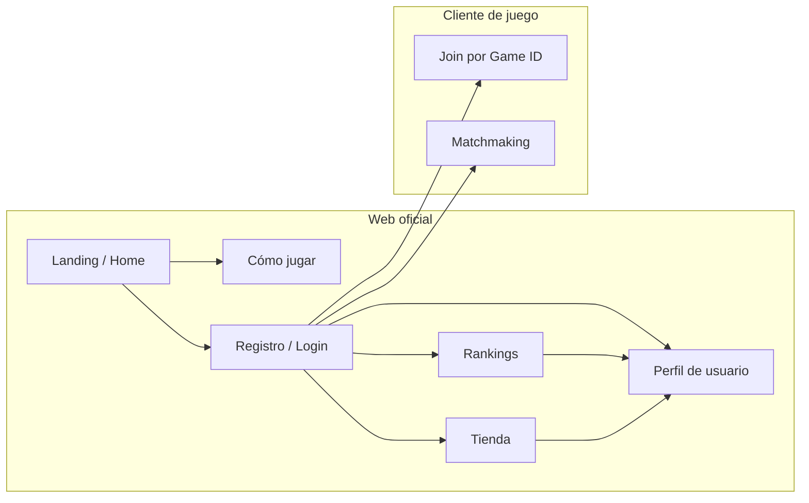

[docs](../docs.md) > frontend > weboficial

# Web oficial — Shadow Tactics

## Visión general

La web oficial es el punto de entrada para todos los jugadores. Independiente del
cliente de juego (React + Socket.IO), funciona como plataforma comunitaria,
informativa y comercial.



---

## Secciones

### 1. Landing / Página principal

| Elemento | Descripción |
|----------|-------------|
| Hero | Título, tagline, captura de pantalla o trailer |
| Call to action | "Jugar ahora" → registro o login |
| Novedades | Últimas noticias, parches, eventos |
| Enlaces rápidos | Cómo jugar, rankings, tienda |
| Footer | Contacto, redes sociales, términos legales |

### 2. Cómo jugar

Documentación completa del juego orientada al jugador:

| Sección | Contenido |
|---------|-----------|
| Introducción | Objetivo del juego: eliminar al general enemigo |
| Fase de preparación | Selección de identidad, tirada de dados, despliegue |
| Fase de juego | DRAW, MAIN, COUNTER — explicación de cada subfase |
| Unidades | Clases (Arquero, Caballería, Lancero, Infantería, General), stats y habilidades |
| Cartas de efecto | Las 13 cartas: BUFF, DEBUFF y COUNTER con ejemplos |
| Cartas de identidad | Las 15 identidades y cómo afectan al juego |
| Combate | Dificultad, críticos, contraataques, modificadores |
| Estrategia | Consejos básicos, sinergias, contrajuego |

Puede incluir contenido multimedia: GIFs animados, diagramas interactivos,
vídeos tutoriales.

### 3. Registro de usuarios

| Funcionalidad | Descripción |
|---------------|-------------|
| Registro | Email + username + contraseña |
| Login | Email o username + contraseña |
| Recuperación de contraseña | Email de restablecimiento |
| Verificación de email | Confirmación antes de jugar |
| Perfil público | Username, avatar, estadísticas básicas |
| Perfil privado | Historial de partidas, estadísticas detalladas, configuración |

**Tecnología:** NextAuth (credentials) + PostgreSQL vía Prisma ORM.

### 4. Rankings

| Elemento | Descripción |
|----------|-------------|
| Tabla de clasificación global | Puntuación ELO, wins/losses, ratio |
| Tabla por temporada | Rankings que se resetean cada temporada (ej: 3 meses) |
| Perfil de jugador | Estadísticas: partidas jugadas, winrate, carta más usada, identidad favorita |
| Historial reciente | Últimas N partidas con resultado y rival |

El sistema de ranking requiere que las partidas competitivas se jueguen a través
del sistema de **matchmaking**, no mediante salas privadas (aunque las privadas
podrían contar como _unranked_).

### 5. Tienda

| Sección | Descripción |
|---------|-------------|
| Skins de unidad | Aspectos visuales alternativos para cada clase |
| Skins de tablero | Temas de color para el hex grid |
| Efectos visuales | Animaciones de dados, cartas, ataques |
| Paquetes | Bundles de contenido con descuento |

**Modelo de monetización:** cosméticos exclusivamente. Sin ventajas competitivas
(pay-to-win). Moneda del juego (_soft currency_) obtenible jugando, y moneda
premium (_hard currency_) comprable con dinero real.

### 6. Cliente de juego

La web oficial **enlaza** al cliente de juego, no lo embedé. Hay dos modos de
acceso:

#### Salas privadas (Game ID)

Sistema actual. El jugador introduce un ID de sala y comparte ese ID con
un amigo. Sin registro requerido. Ideal para partidas amistosas.

```
Web oficial → "Jugar con amigos" → Cliente de juego (localhost:5173)
  └─ Input: Game ID
  └─ Compartir ID con el rival
  └─ Ambos se conectan → partida
```

#### Matchmaking

Sistema con registro requerido. El servidor empareja jugadores usando una cola en memoria dentro de Next.js API routes.

```
Web oficial → /jugar → "Partida rápida" / "Ranked" → matchmaking → Cliente de juego
  └─ Jugador solicita partida (POST /api/matchmaking/join)
  └─ Cola en memoria: quickplayQueue / rankedQueue
  └─ Emparejamiento: ELO ± margen creciente para ranked, cualquier rango para quickplay
  └─ Asigna Game ID (8 chars hex) y crea ActiveMatch
  └─ Ambos redirigidos al cliente con userId + matchType vía query params
  └─ Cliente conecta al Socket.IO server con JOIN_GAME
  └─ Cuando ambos conectan, se notifica a /api/games/start para cancelar el timeout del ActiveMatch
  └─ Al terminar la partida, el Socket.IO server envía el reporte a /api/games/report
```

**Ciclo de vida del ActiveMatch:**

| Evento | Acción |
|--------|--------|
| Match creado | `setTimeout` 30s programado para limpiar el match si nadie conecta |
| Ambos jugadores conectan | Fetch a `/api/games/start` → `confirmGameStarted()` cancela el timeout |
| Partida termina | Reporte a `/api/games/report` → procesa ELO + estadísticas → elimina el match |
| Timeout (30s) sin conexión | Match se elimina automáticamente de `activeMatches` |

**Modos disponibles:**

| Modo | Efecto en ELO | Matchmaking |
|------|---------------|-------------|
| Partida rápida | No afecta ELO | Cualquier oponente disponible |
| Ranked | Afecta ELO | Oponente con ELO similar (±50-300 según espera) |
| Invitar amigo | No afecta ELO | Sala privada entre dos usuarios registrados |

**API endpoints:**

| Ruta | Método | Propósito |
|------|--------|-----------|
| `/api/matchmaking/join` | POST | Entrar a cola (body: `{ type: 'quickplay' | 'ranked' }`) |
| `/api/matchmaking/status` | GET | Consultar estado de la búsqueda |
| `/api/matchmaking/leave` | POST | Salir de la cola |
| `/api/matchmaking/invite` | POST | Crear invitación (body: `{ username }`) |
| `/api/matchmaking/invites` | GET | Listar invitaciones pendientes |
| `/api/matchmaking/invites/accept` | POST | Aceptar invitación (body: `{ inviteId }`) |
| `/api/games/report` | POST | Recibir reporte de partida desde Socket.IO server |
| `/api/games/start` | POST | Notificar que ambos jugadores conectaron (cancela timeout) |

---

## Relación con el cliente de juego

### Flujo completo (matchmaking → juego → reporte)

```
                          ┌──────────────────────┐
                          │    Web oficial       │
                          │  (Next.js :3001)     │
                          │                      │
                          │  /jugar (UI cola)    │
                          │  /api/matchmaking/*  │
                          │  /api/games/report   │
                          │  /api/games/start    │
                          │  activeMatches[]     │
                          └──────┬───────────────┘
                                 │
                    ┌────────────┴────────────┐
                    │                         │
                    ▼                         ▼
         ┌──────────────────┐     ┌──────────────────────┐
         │  Matchmaking:    │     │  Redirección HTTP    │
         │  POST /join      │     │  con query params    │
         │  Crea ActiveMatch│     │  ?userId&matchType   │
         │  + setTimeout 30s│     └──────────┬───────────┘
         └────────┬─────────┘                │
                  │                          │
                  ▼                          ▼
         ┌─────────────────────────────────────────┐
         │      Cliente de juego (Vite :5173)      │
         │      App.tsx lee URL → joinGame()       │
         └────────────────┬────────────────────────┘
                          │ Socket.IO
                          ▼
         ┌─────────────────────────────────────────┐
         │   Servidor Socket.IO (:3000)            │
         │                                         │
         │   JOIN_GAME → room.join()               │
         │   getPlayerCount() === 2 →              │
         │     ├─ fetch /api/games/start           │
         │     └─ onGameOverCallback set            │
         │                                         │
         │   Game over → onGameOverCallback →      │
         │     submitReport() → POST /api/games/report
         └─────────────────────────────────────────┘
```

---

## Stack actual

| Capa | Tecnología |
|------|-----------|
| Frontend | Next.js 15 (App Router) |
| Estilos | Tailwind CSS 4 |
| Backend | Next.js API routes |
| Base de datos | PostgreSQL |
| Autenticación | NextAuth v5 (credentials) con bcrypt |
| ORM | Prisma |
| Servidor de juego separado | Socket.IO 4 (puerto 3000) |

> La web oficial y el servidor de juego son procesos independientes.
> Se comunican vía HTTP (fetch) para la notificación de inicio y reporte de partidas.

---

## Estado actual

| Componente | Estado |
|-----------|--------|
| Landing / Home | ✅ Implementada |
| Registro de usuarios | ✅ Implementado (email + username + password + bcrypt) |
| Login / Logout | ✅ Implementado (NextAuth credentials) |
| Rankings | ✅ Implementado (tabla ELO global) |
| Perfil de usuario | ✅ Implementado (stats, historial) |
| Matchmaking (quickplay) | ✅ Implementado |
| Matchmaking (ranked) | ✅ Implementado |
| Invitar amigo | ✅ Implementado |
| Reporte de partidas | ✅ Implementado (POST /api/games/report) |
| Página "Jugar" | ✅ Implementada |
| Página "Cómo jugar" | ⬜ En desarrollo |
| Tienda | ❌ No implementada |
| Recuperación de contraseña | ❌ No implementada |
| Sala privada por Game ID | ✅ Implementada (vía cliente de juego directo) |
