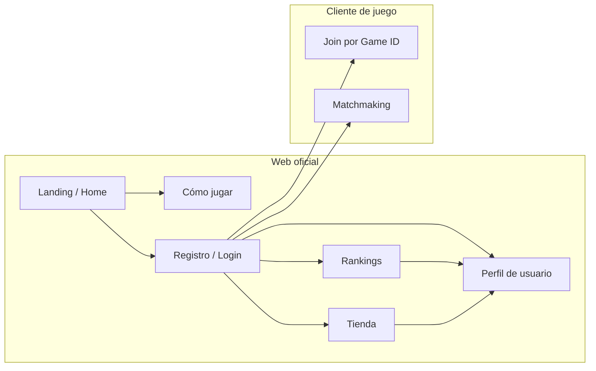

[docs](../docs.md) > frontend > weboficial

# Web oficial — Shadow Tactics

## Visión general

La web oficial es el punto de entrada para todos los jugadores. Independiente del
cliente de juego (React + Socket.IO), funciona como plataforma comunitaria,
informativa y comercial.



---

## Secciones

### 1. Landing / Página principal

| Elemento | Descripción |
|----------|-------------|
| Hero | Título, tagline, captura de pantalla o trailer |
| Call to action | "Jugar ahora" → registro o login |
| Novedades | Últimas noticias, parches, eventos |
| Enlaces rápidos | Cómo jugar, rankings, tienda |
| Footer | Contacto, redes sociales, términos legales |

### 2. Cómo jugar

Documentación completa del juego orientada al jugador:

| Sección | Contenido |
|---------|-----------|
| Introducción | Objetivo del juego: eliminar al general enemigo |
| Fase de preparación | Selección de identidad, tirada de dados, despliegue |
| Fase de juego | DRAW, MAIN, COUNTER — explicación de cada subfase |
| Unidades | Clases (Arquero, Caballería, Lancero, Infantería, General), stats y habilidades |
| Cartas de efecto | Las 13 cartas: BUFF, DEBUFF y COUNTER con ejemplos |
| Cartas de identidad | Las 15 identidades y cómo afectan al juego |
| Combate | Dificultad, críticos, contraataques, modificadores |
| Estrategia | Consejos básicos, sinergias, contrajuego |

Puede incluir contenido multimedia: GIFs animados, diagramas interactivos,
vídeos tutoriales.

### 3. Registro de usuarios

| Funcionalidad | Descripción |
|---------------|-------------|
| Registro | Email + username + contraseña |
| Login | Email o username + contraseña |
| Recuperación de contraseña | Email de restablecimiento |
| Verificación de email | Confirmación antes de jugar |
| Perfil público | Username, avatar, estadísticas básicas |
| Perfil privado | Historial de partidas, estadísticas detalladas, configuración |

**Tecnología sugerida:** JWT + base de datos relacional (PostgreSQL).
El stack concreto está por definir (puede ser un backend separado del servidor
de juego, o integrarse con el mismo Node.js).

### 4. Rankings

| Elemento | Descripción |
|----------|-------------|
| Tabla de clasificación global | Puntuación ELO, wins/losses, ratio |
| Tabla por temporada | Rankings que se resetean cada temporada (ej: 3 meses) |
| Perfil de jugador | Estadísticas: partidas jugadas, winrate, carta más usada, identidad favorita |
| Historial reciente | Últimas N partidas con resultado y rival |

El sistema de ranking requiere que las partidas competitivas se jueguen a través
del sistema de **matchmaking**, no mediante salas privadas (aunque las privadas
podrían contar como _unranked_).

### 5. Tienda

| Sección | Descripción |
|---------|-------------|
| Skins de unidad | Aspectos visuales alternativos para cada clase |
| Skins de tablero | Temas de color para el hex grid |
| Efectos visuales | Animaciones de dados, cartas, ataques |
| Paquetes | Bundles de contenido con descuento |

**Modelo de monetización:** cosméticos exclusivamente. Sin ventajas competitivas
(pay-to-win). Moneda del juego (_soft currency_) obtenible jugando, y moneda
premium (_hard currency_) comprable con dinero real.

### 6. Cliente de juego

La web oficial **enlaza** al cliente de juego, no lo embedé. Hay dos modos de
acceso:

#### Salas privadas (Game ID)

Sistema actual. El jugador introduce un ID de sala y comparte ese ID con
un amigo. Sin registro requerido. Ideal para partidas amistosas.

```
Web oficial → "Jugar con amigos" → Cliente de juego (localhost:5173)
  └─ Input: Game ID
  └─ Compartir ID con el rival
  └─ Ambos se conectan → partida
```

#### Matchmaking (juego competitivo)

Sistema con registro requerido. El servidor empareja jugadores de rango similar.

```
Web oficial → "Partida rápida" → matchmaking → Cliente de juego
  └─ Jugador solicita partida
  └─ Servidor busca oponente del mismo rango
  └─ Asigna Game ID automáticamente
  └─ Ambos redirigidos al cliente con ese ID
  └─ Partida competitiva (afecta ranking)
```

El matchmaking requiere:
- Servicio de cola de emparejamiento (posiblemente independiente del servidor de juego)
- Base de datos de usuarios y rankings
- Lógica de ELO / puntuación
- Timeout y cancelación de búsqueda

---

## Relación con el cliente de juego

```
                          ┌──────────────────┐
                          │   Web oficial    │
                          │  (Next.js / SPA) │
                          │                  │
                          │  Landing         │
                          │  Cómo jugar      │
                          │  Registro/Login  │
                          │  Rankings        │
                          │  Tienda          │
                          └────────┬─────────┘
                                   │
                     ┌─────────────┴─────────────┐
                     │                           │
                     ▼                           ▼
          ┌──────────────────┐       ┌──────────────────┐
          │  Matchmaking     │       │  Redirige a      │
          │  (servicio cola) │       │  cliente juego   │
          └────────┬─────────┘       │  con Game ID     │
                   │                 └────────┬─────────┘
                   ▼                          │
          ┌──────────────────┐                │
          │  Servidor juego  │◄───────────────┘
          │  (Socket.IO)     │
          └──────────────────┘
```

---

## Stack sugerido para la web oficial

| Capa | Opción |
|------|--------|
| Frontend | Next.js 14+ o React SPA con router |
| Estilos | Tailwind CSS |
| Backend | Node.js + Express o Next.js API routes |
| Base de datos | PostgreSQL |
| Autenticación | JWT + bcrypt |
| ORM | Prisma o Drizzle |
| Despliegue | Vercel / Railway / servidor propio |

> El stack no está decidido — esta sección se actualizará cuando se inicie
> el desarrollo de la web oficial.

---

## Estado

| Componente | Estado |
|-----------|--------|
| Web oficial | ❎ No implementada |
| Registro de usuarios | ❎ No implementado |
| Rankings | ❎ No implementado |
| Tienda | ❎ No implementada |
| Matchmaking | ❎ No implementado |
| Página "Cómo jugar" | ❎ No implementada |

Toda la lógica de la web oficial está **fuera del alcance actual** del proyecto.
El cliente de juego funciona de forma independiente con el sistema de salas
privadas por Game ID.
