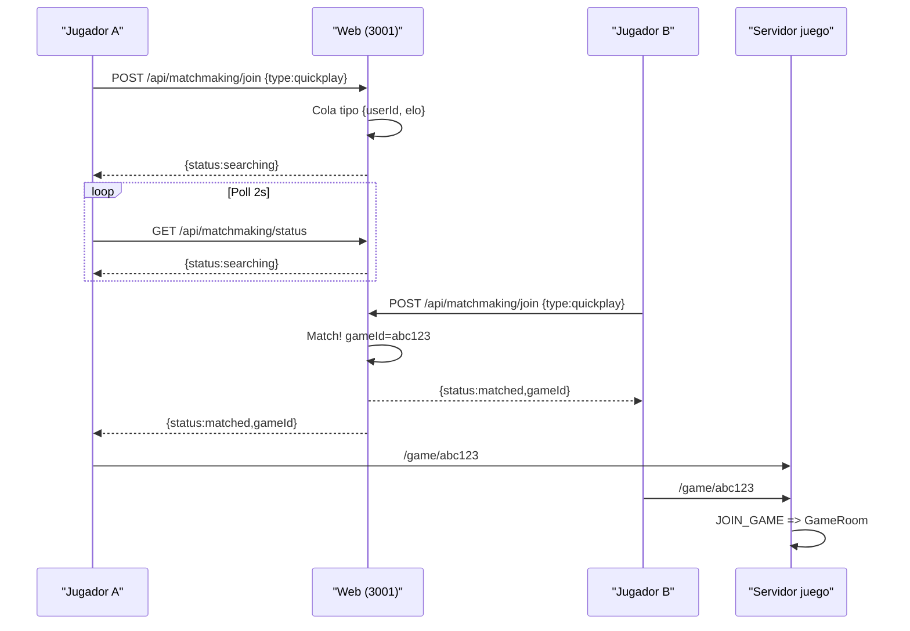
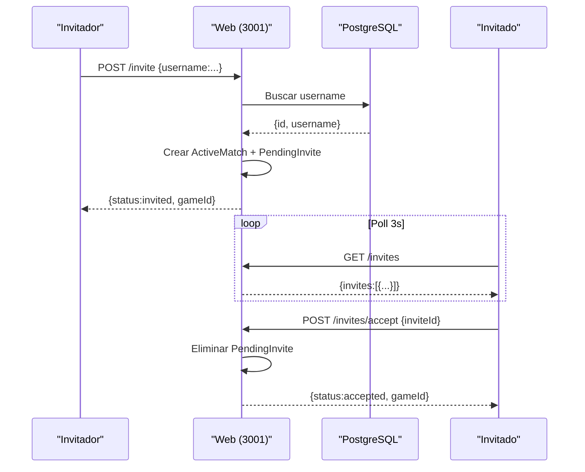
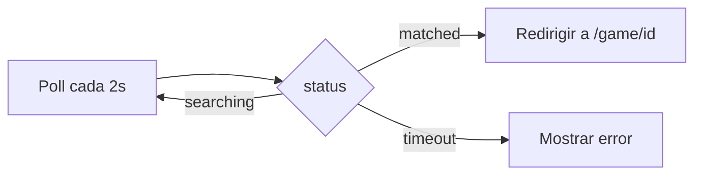
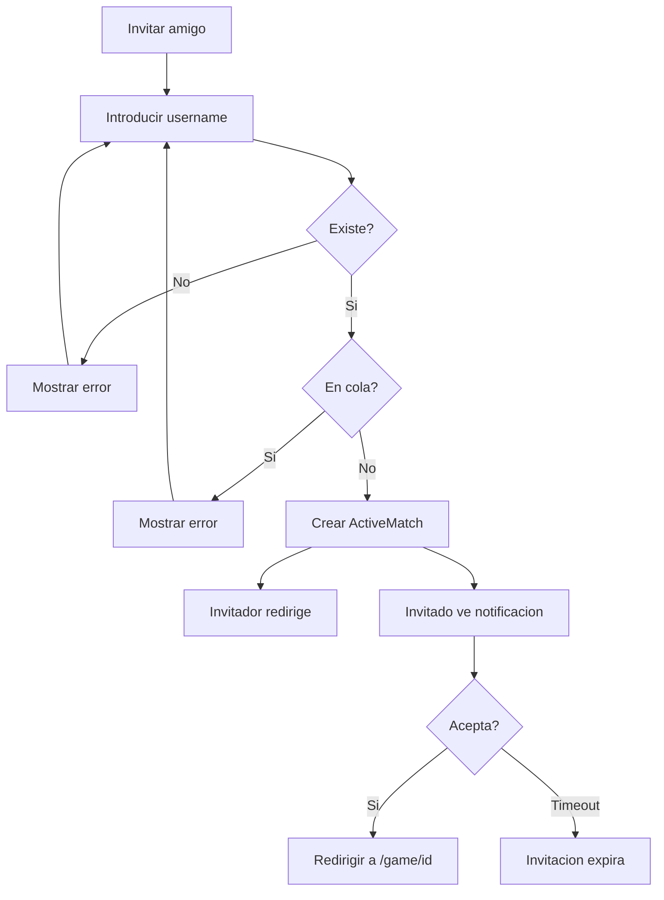
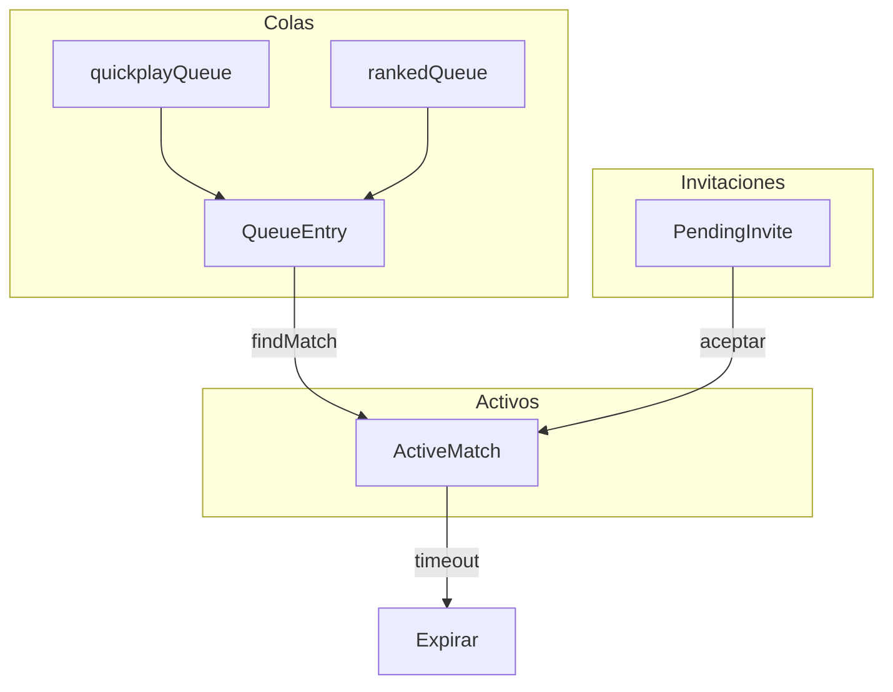
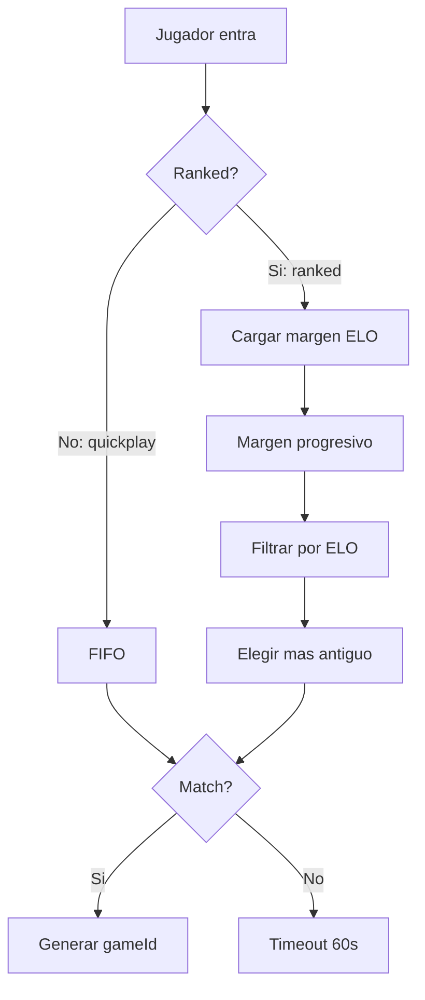
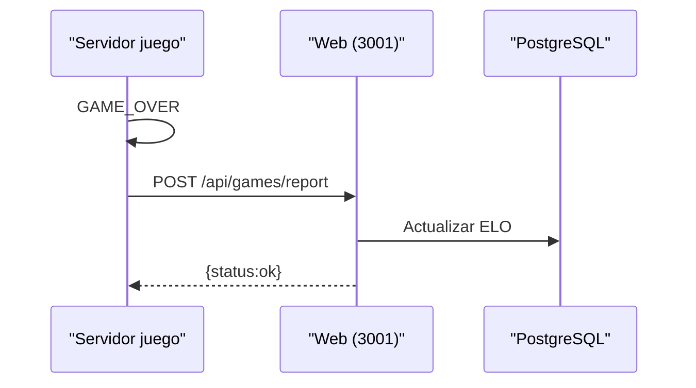

[docs](../docs.md) > [web](./docs.md) > fase4

# Fase 4 — Matchmaking

**Estado:** ✅ Completada

## Objetivo

Implementar un sistema de emparejamiento (_matchmaking_) con tres modos de juego:
**Partida rápida** (no ranked, sin filtro ELO), **Ranked** (emparejamiento por ELO) e
**Invitar a un amigo** (sala directa por username). En todos los casos se redirige al
cliente de juego con un `gameId` generado por el servidor.

---

## Modos de juego

| Modo | Cola | Filtro ELO | Afecta ranking | Cómo se empareja |
|------|------|------------|----------------|------------------|
| Partida rápida | `quickplayQueue` | Ninguno | No | Cualquier jugador en cola (FIFO) |
| Ranked | `rankedQueue` | Progresivo 50→300 | Sí | Por ELO, margen se expande con tiempo |
| Invitar amigo | — | — | No | Se crea match directo por username |

---

## Diagramas de flujo

### Quickplay / Ranked



### Invitar a un amigo



---

## Flujo detallado

### 1. Selección de modo

1. El jugador entra a `/jugar`.
2. Ve tres opciones: **Partida rápida**, **Ranked**, **Invitar amigo**.
3. Simultáneamente, el frontend hace poll cada 3s a `GET /api/matchmaking/invites`
   para mostrar invitaciones entrantes con botón "Aceptar".

### 2. Solicitar partida (Quickplay / Ranked)

1. El jugador elige modo y hace clic en "Buscar partida".
2. Frontend llama a `POST /api/matchmaking/join` con `{ type: 'quickplay' | 'ranked' }`.
3. El servidor:
   - Lee `userId` y `elo` desde la sesión
   - Añade `{ userId, elo, type, joinedAt }` a la cola correspondiente
   - Devuelve `{ status: 'searching', position }`
4. El frontend comienza **polling** cada 2 segundos a `GET /api/matchmaking/status`.

### 3. Emparejamiento

**Quickplay:**
- Busca en `quickplayQueue` al jugador que lleva más tiempo esperando (FIFO).
- Sin filtro de ELO — cualquiera empareja con cualquiera.

**Ranked:**
- Busca en `rankedQueue` jugadores con ELO dentro del rango `[playerElo - margin, playerElo + margin]`.
- `margin` comienza en 50 y se expande +50 cada 5 segundos en cola (máx 300).
- Si hay múltiples candidatos, elige al que lleva más tiempo esperando (FIFO).

**Al encontrar match (ambos modos):**
- Genera un `gameId` único (UUID v4, primeros 8 chars).
- Crea `ActiveMatch { gameId, userIds, type, isRanked, matchedAt }`.
- Elimina ambos jugadores de la cola.
- Programa expiración del match a los 30s (por si no se conectan).

### 4. Notificar y redirigir



1. El siguiente `poll` de cada jugador recibe `{ status: 'matched', gameId }`.
2. El frontend redirige a `http://localhost:5173/game/<id>` tras 1.5s.
3. El cliente de juego (Vite) lee `gameId` del pathname `/game/<id>` y emite `JOIN_GAME` automáticamente.

> **Nota:** El servidor de juego (puerto 3000) ya tiene `rooms.ts` que crea un `GameRoom`
> automáticamente al llamar `getRoom(gameId)`. No necesita cambios — el room se crea
> bajo demanda cuando el primer jugador se conecta vía Socket.IO.

### 5. Invitar a un amigo



1. El jugador introduce el nombre de usuario de su amigo.
2. Frontend llama a `POST /api/matchmaking/invite { username }`.
3. El servidor:
   - Busca al usuario en la BD.
   - Valida que no sea el mismo usuario, ni esté en partida o cola.
   - Crea `ActiveMatch` con ambos userIds y `PendingInvite` con timeout 30s.
   - Devuelve `{ status: 'invited', gameId }`.
4. El invitador redirige a `/game/<id>`.
5. El amigo (invitado) ve la invitación en su selector de modo (polling 3s).
6. Al hacer clic en "Aceptar", llama a `POST /api/matchmaking/invites/accept`
   y redirige al juego.

### 6. Cancelar búsqueda

1. Mientras está en `searching`, el jugador puede cancelar.
2. Frontend llama a `POST /api/matchmaking/leave`.
3. Servidor elimina al jugador de ambas colas.

### 7. Timeout

1. Si un jugador pasa más de 60 segundos en cola sin ser emparejado:
   - Se elimina automáticamente de la cola.
   - El próximo `poll` recibe `{ status: 'timeout' }`.
   - Frontend muestra "No se encontró oponente. Intenta de nuevo."
2. Las invitaciones expiran a los 30s si el invitado no acepta.

---

## Cola de emparejamiento

### Estructura en memoria

```typescript
type QueueType = 'quickplay' | 'ranked';

type QueueEntry = {
    userId: string;
    username: string;
    elo: number;
    type: QueueType;
    joinedAt: number;
};

type ActiveMatch = {
    gameId: string;
    userIds: string[];
    type: QueueType;
    isRanked: boolean;
    matchedAt: number;
};

type PendingInvite = {
    id: string;
    inviterId: string;
    inviterName: string;
    invitedId: string;
    gameId: string;
    createdAt: number;
};
```



Dos colas independientes en memoria: `quickplayQueue` y `rankedQueue`.

### Lógica de matching

```typescript
function findMatch(entry: QueueEntry): QueueEntry | null {
    const queue = getQueue(entry.type);
    const inQueue = queue.filter(
        (c) => c.userId !== entry.userId && Date.now() - c.joinedAt < TIMEOUT_MS
    );

    if (entry.type === 'quickplay') {
        return inQueue.sort((a, b) => a.joinedAt - b.joinedAt)[0] ?? null;
    }

    // ranked: margen progresivo
    const elapsed = (Date.now() - entry.joinedAt) / 1000;
    const margin = Math.min(50 + Math.floor(elapsed / 5) * 50, 300);
    const candidates = inQueue
        .filter((c) => Math.abs(c.elo - entry.elo) <= margin)
        .sort((a, b) => a.joinedAt - b.joinedAt);

    return candidates[0] ?? null;
}
```

### Diagrama de decisión de matching



---

## API endpoints

### `POST /api/matchmaking/join`

**Requiere:** Autenticación (JWT de NextAuth)

**Body:**
```json
{ "type": "quickplay" | "ranked" }
```

**Respuesta (searching):**
```json
{ "status": "searching", "position": 1 }
```

**Respuesta (matched directo — si ya había alguien esperando):**
```json
{ "status": "matched", "gameId": "a1b2c3d4", "opponent": { "username": "Rival", "elo": 1050 } }
```

### `GET /api/matchmaking/status`

**Requiere:** Autenticación (JWT de NextAuth)

**Respuestas:**
```json
// Buscando
{ "status": "searching", "queueLength": 3, "elapsed": 12 }

// Match encontrado
{ "status": "matched", "gameId": "a1b2c3d4" }

// Timeout
{ "status": "timeout" }
```

### `POST /api/matchmaking/leave`

**Requiere:** Autenticación (JWT de NextAuth)

**Respuesta:**
```json
{ "status": "cancelled" }
```

### `POST /api/matchmaking/invite`

**Requiere:** Autenticación (JWT de NextAuth)

**Body:**
```json
{ "username": "amigo" }
```

**Respuesta:**
```json
// Invitación creada
{ "status": "invited", "gameId": "a1b2c3d4" }

// Error
{ "status": "error", "message": "Usuario no encontrado" }
```

### `GET /api/matchmaking/invites`

**Requiere:** Autenticación (JWT de NextAuth)

**Respuesta:**
```json
{ "invites": [{ "id": "inv123", "inviterName": "Jugador1" }] }
```

### `POST /api/matchmaking/invites/accept`

**Requiere:** Autenticación (JWT de NextAuth)

**Body:**
```json
{ "inviteId": "inv123" }
```

**Respuesta:**
```json
{ "status": "accepted", "gameId": "a1b2c3d4" }
```

---

## Archivos creados/modificados

### Nuevos

| Archivo | Descripción |
|---------|-------------|
| `lib/matchmaking.ts` | Colas quickplay + ranked en memoria, lógica de matching, sistema de invitaciones |
| `app/api/matchmaking/join/route.ts` | Endpoint para entrar en cola (acepta `type`) |
| `app/api/matchmaking/leave/route.ts` | Endpoint para salir de cola |
| `app/api/matchmaking/status/route.ts` | Endpoint para estado de la búsqueda |
| `app/api/matchmaking/invite/route.ts` | Endpoint para invitar por username |
| `app/api/matchmaking/invites/route.ts` | Endpoint para listar invitaciones pendientes |
| `app/api/matchmaking/invites/accept/route.ts` | Endpoint para aceptar una invitación |
| `app/jugar/page.tsx` | Página única: selector de modo + cola + invitaciones |

### Modificados

| Archivo | Cambio |
|---------|--------|
| `app/perfil/page.tsx` | Link actualizado de `/partidarapida` → `/jugar` |
| `app/page.tsx` | Link actualizado de `/partidarapida` → `/jugar` |
| `components/Navbar.tsx` | Enlace "Partida rápida" → "Jugar" con href `/jugar` |
| `src/client/App.tsx` | Leer `gameId` del pathname `/game/<id>` y auto-join |

### Eliminados

| Archivo | Motivo |
|---------|--------|
| `app/partidarapida/page.tsx` | Reemplazado por `app/jugar/page.tsx` |

---

## UI/UX

### Selector de modo (`/jugar`)

```
┌──────────────────────────────────┐
│  ⚔️ Partida rápida                │  ← borde amarillo
│     Sin afectar tu ELO            │
├──────────────────────────────────┤
│  🏆 Ranked                        │  ← borde brand
│     Compite por ELO               │
├──────────────────────────────────┤
│  👤 Invitar amigo                 │  ← borde esmeralda
│     Sala privada con un amigo     │
└──────────────────────────────────┘

  ┌─ Invitación entrante (si hay) ─┐
  │  Juan te ha invitado           │
  │  [Aceptar]                     │
  └────────────────────────────────┘
```

### Invitar amigo

```
┌──────────────────────────────────┐
│  Invitar a un amigo              │
│                                  │
│  [Nombre de usuario] [Invitar]   │
│                                  │
│  ✅ Invitación enviada           │
│     Redirigiendo...              │
└──────────────────────────────────┘
```

### Cola de búsqueda (Quickplay / Ranked)

```
┌──────────────────────────────┐
│  Buscando oponente...        │
│  ┌────────────────────┐      │
│  │     🎲             │      │  ← spinner
│  └────────────────────┘      │
│  Tiempo: 12s                 │
│  Jugadores en cola: 3        │
│  [Cancelar]                  │
└──────────────────────────────┘
```

### Match encontrado

```
┌──────────────────────────────┐
│  ✅ Partida encontrada!      │
│                              │
│  Oponente: Cazador_Rojo      │
│  ELO: 1150                   │
│                              │
│  Redirigiendo al juego...    │
└──────────────────────────────┘
```

---

## Integración con el servidor de juego

El servidor de juego (`src/server/`) **no necesita cambios** para el matchmaking básico:

- `rooms.ts` ya crea `GameRoom` bajo demanda con `getRoom(gameId)`.
- Cuando el primer jugador emite `JOIN_GAME { gameId }`, el room se crea automáticamente.
- Cuando el segundo jugador se une, se emite `BOTH_PLAYERS_READY`.

### Para ELO post-partida (futuro)



En el futuro, cuando termine una partida ranked, el servidor de juego podría notificar
a la web oficial para actualizar ELO. Esto requiere un endpoint `POST /api/games/report`
en la web oficial, que el servidor de juego llamaría vía HTTP después de un
`GAME_OVER`. No forma parte de esta fase.

---

## Próximos pasos tras Fase 4

- **Rankings** — Tabla de clasificación global consultando la BD
- **Reporte post-partida** — Actualización de ELO desde el servidor de juego
- **Persistencia** — Migrar cola de memoria a Redis para producción
- **Notificaciones** — WebSockets para invitaciones en tiempo real (sin polling)
